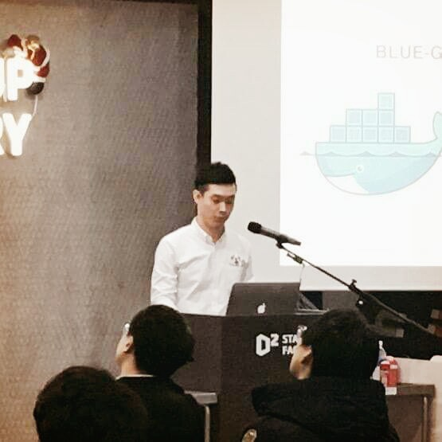
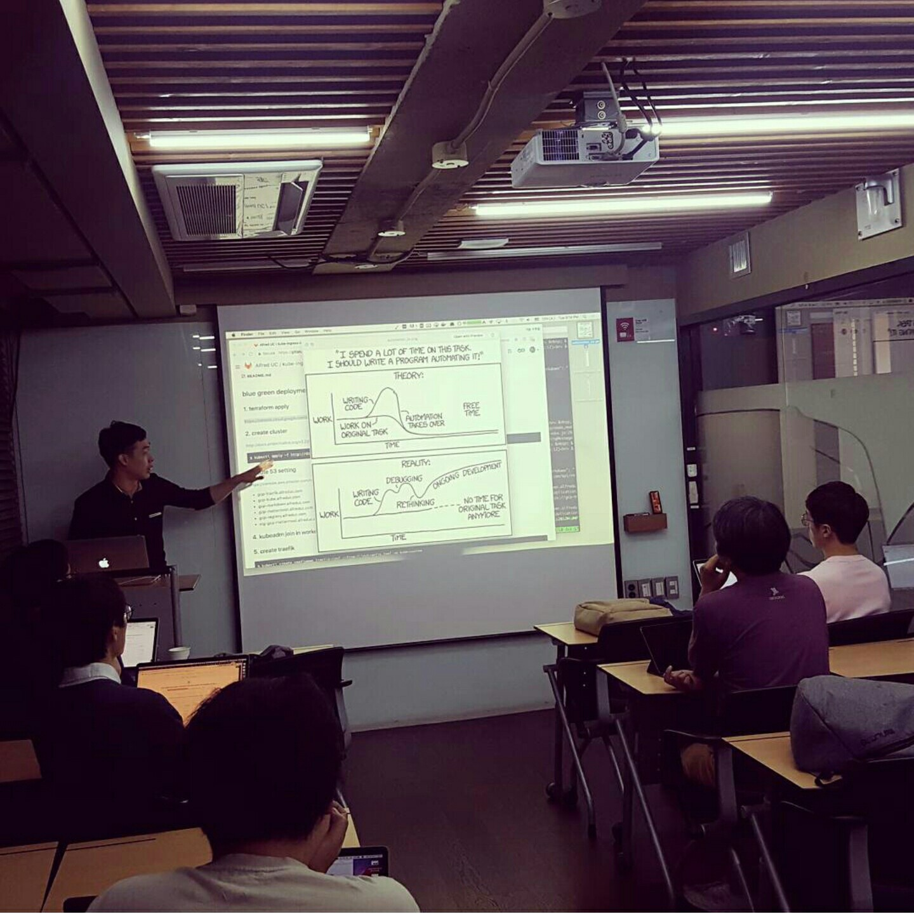
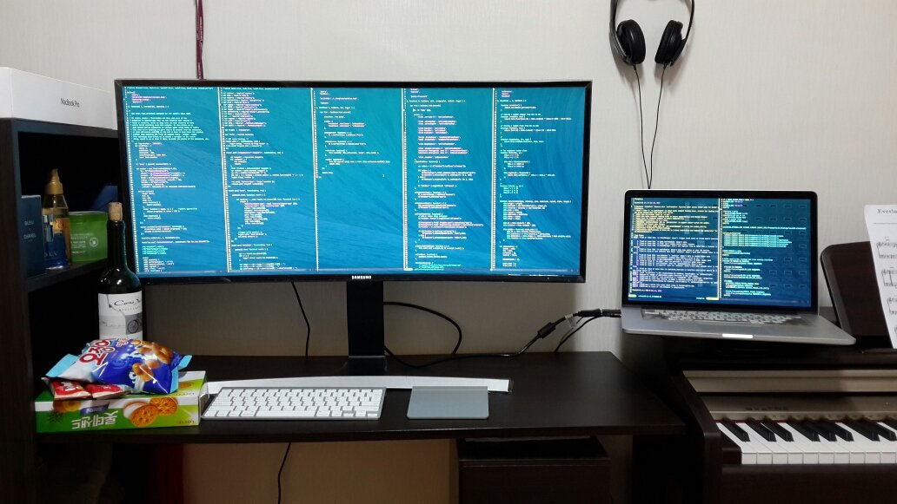
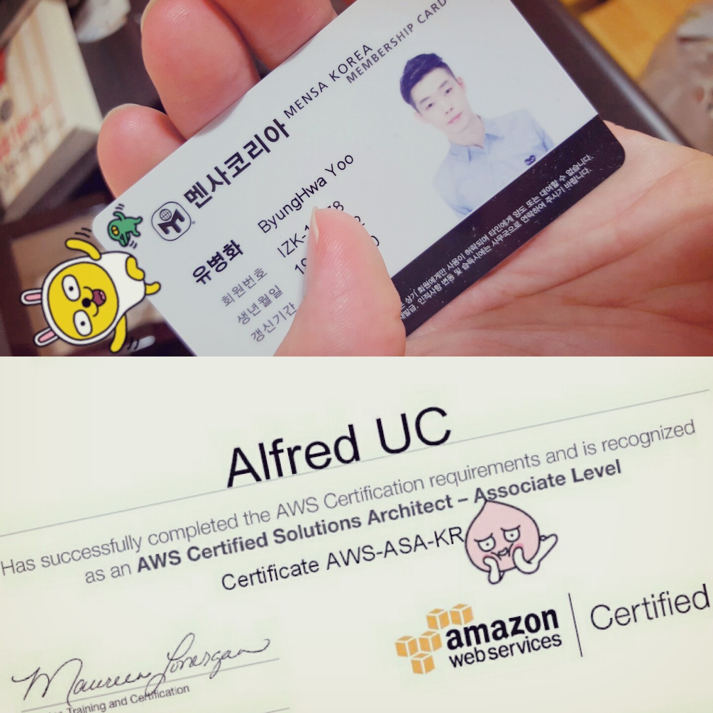
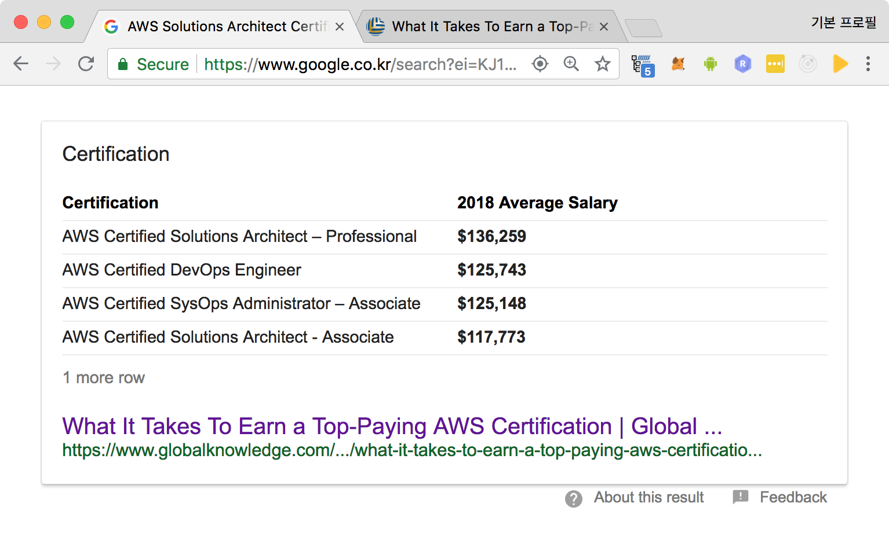
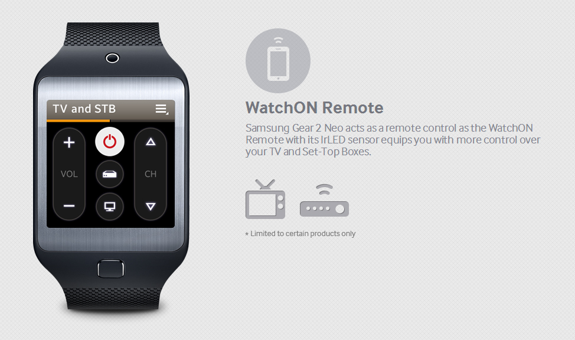
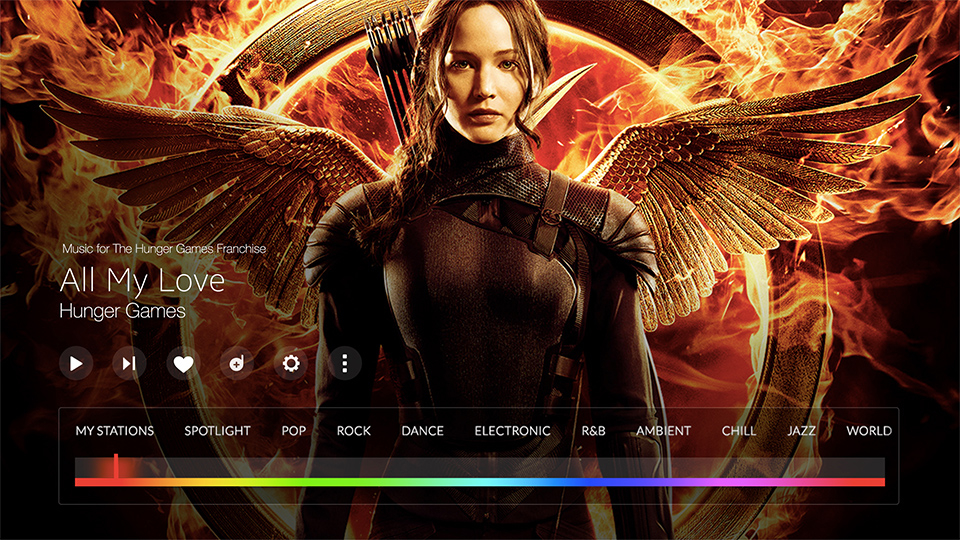
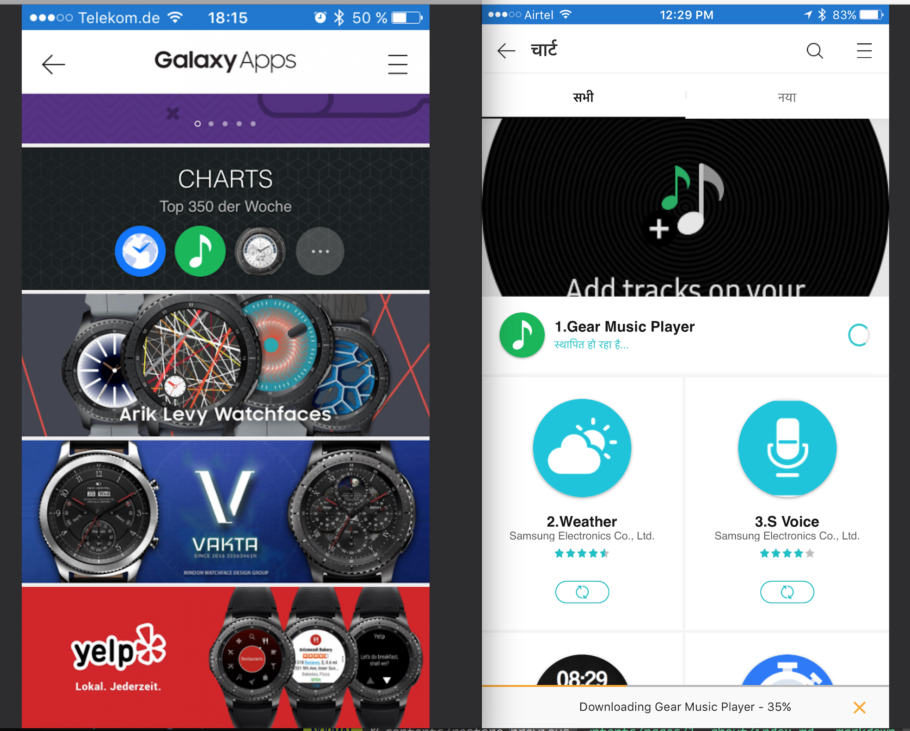

- 유 병화 입니다
- I'm Alfred UC
- alfreduc is my nickname
- http://aluc.io is my space

- I'm a Software Engineer in [Korea][korea]
- I'm working at [Samsung Electronics][sec]
- My native program language is [Javascript][awesome_js]
- I'm interested in [UX][ux]
- I do develop and design [Front-end Web][frontend_web]
- I do develop and design Server program
- I do develop and design [Infrastructure as code][iac]
- I love [Vim][vim]
- I love [React][reactjs]
- I love [redux][redux]
- I love [Nodejs][nodejs]
- I love [Docker][docker]

- I like [Python][python]
- I like [Ansible][ansible]
- I'm interested in [Go][go]
- I'm interested in Infrastructure as code like [terraform][terraform]
- I'm interested in [GraphQL][graphql]
- I love Immutable something
- I'm interested in [DevOps][devops]
- I like [Vault][vault]
- I like [Vagrant][vagrantup]
- I like [Kubernetes][kube]
- I love Automation

- I'm interested in Effective [DX][dx]
- I'm interested in [Decentralized application][dapp]
- I will try to develop [React Native][reactnative]
- I will try to develop smart contract like a [solidity][solidity]

- I love [MacOS][macos], [Ubuntu][ubuntu]
- I love [Big Monitor][big_monitor]

- I love [git][git]
- I love [gitlab][gitlab]
- I love [markdown][md]
- I love [CLI][cli] better than [GUI][gui]
- I'm interested in collaborative workflow

- I have a [AWS Solutions Architect Certification][aws_certi]
- I'm member of [Mensa][mensa]

---

## Projects

- I developed [EPub][epub] Viewer (on [Tizen][tizen])

- I developed and released Gear2 [WatchOn Remote][watchon]

- I developed Gear S Milk (Web client)
- I developed Tizen TV Milk (Web client)
- I developed Milk Web version

- I developed and released Gear App Store Client (Mobile Web Version)

- I'm work on [Galaxy App Store Server][gas] ([Java Spring Framework][https://spring.io/])

- Special Thanks to [@greglobinski][greglobinski]

[greglobinski]: https://twitter.com/greglobinski
[mensa]: http://www.mensa.org/
[aws_certi]: https://aws.amazon.com/certification/certified-solutions-architect-associate/
[sed]: https://www.samsung.com/sec/aboutsamsung/home/
[korea]: https://en.wikipedia.org/wiki/Korea
[nodejs]: https://nodejs.org/
[reactjs]: https://reactjs.org/
[vim]: https://www.vim.org/
[docker]: https://www.docker.com/
[python]: https://www.python.org/
[kube]: https://kubernetes.io/
[ansible]: https://www.ansible.com/
[go]: https://golang.org/
[terraform]: https://www.terraform.io/
[dx]: http://everydeveloper.com/developer-experience/
[epub]: https://en.wikipedia.org/wiki/EPUB
[gas]: https://www.samsung.com/global/galaxy/apps/galaxy-apps/
[watchon]: https://www.iotgadgets.com/2014/04/tizen-samsung-gear-2-watchon-remote-app-now-ready-control-airconditioner/
[watchon_manual]: https://www.manualslib.com/manual/754923/Samsung-Gear-2.html?page=59#manual
[devops]: http://aluc.io/slide-docker-devops/
[graphql]: https://graphql.org/
[redux]: https://redux.js.org/
[vault]: https://www.vaultproject.io/
[vagrant]: http://vagrantup.com/
[reactnative]: https://facebook.github.io/react-native/
[dapp]: https://en.wikipedia.org/wiki/Decentralized_application
[solidity]: https://solidity.readthedocs.io/
[ubuntu]: https://www.ubuntu.com/
[macos]: https://www.apple.com/lae/macos/
[big_monitor]: https://www.samsung.com/us/computing/monitors/curved/34-ultra-wide-curved-screen-monitor-ls34e790cns-za/
[awesome_js]: https://github.com/sorrycc/awesome-javascript
[ux]: https://en.wikipedia.org/wiki/User_experience
[frontend_web]: https://en.wikipedia.org/wiki/Front-end_web_development
[iac]: https://en.wikipedia.org/wiki/Infrastructure_as_Code
[md]: https://en.wikipedia.org/wiki/Markdown
[git]: https://git-scm.com/
[gitlab]: https://gitlab.com/
[cli]: https://en.wikipedia.org/wiki/Command-line_interface
[gui]: https://en.wikipedia.org/wiki/Graphical_user_interface
[tizen]: https://www.tizen.org/
