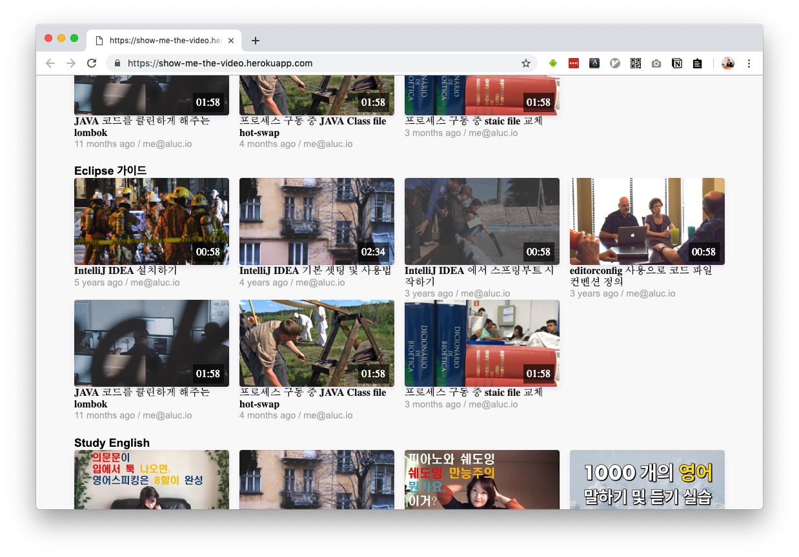

## whoami

```yaml
me:
  nickname: aluc
  name:
    ko: 유병화
    en: Alfreduc, Yoo
  country:
    ISO3166-1-alpha-3: KOR
    ISO3166-1-alpha-2: KR
    flag: 🇰🇷
  web: https://aluc.io/
  career: SW Engineer
```


## Top 5 Language skill

```yaml
[
  'javascript',
  'korean',
  'typescript',
  'java',
  'python',
]
```


## My Graduated tools
`Graduation` does not mean **mastered**. It just means a tool
with a lot of experience and a level of proficiency enough
to briefly explain to the peers the basic usage of the tool.

```js
[
  { name: `react`,                tag: ['web']                               },
  { name: `redux`,                tag: ['state_management']                  },
  { name: `nodejs`,               tag: ['rumtime']                           },
  { name: 'gitlab-ci',            tag: ['code_pipeline']                     },
  { name: 'jenkins',              tag: ['automation']                        },
  { name: `git`,                  tag: ['VCS']                               },
  { name: `docker`,               tag: ['container']                         },
  { name: `babel`,                tag: ['compiler']                          },

  { name: `slack`,                tag: ['communication']                     },
  { name: `markdown`,             tag: ['content_format']                    },

  { name: `jquery`,               tag: ['web'],             deprecated: true },
  { name: `vim`,                  tag: ['editor']           deprecated: true },
]
```

## My Incubating tool
`Incubating` means a tool that has some experience of using
it but needs more experience and study to solve the problem.

```js
[
  { name: `webpack`,              tag: ['web']  },
  { name: `gatsby`,               tag: ['web']  },
  { name: `jest`,                 tag: ['test'] },
  { name: `mocha`,                tag: ['test'] },

  { name: `serverless framework`, tag: ['serverless']  },

  { name: `VS Code`,              tag: ['IDE'] },
  { name: `IntelliJ`,             tag: ['IDE'] },

  { name: `gradle`,               tag: ['build'] },
  { name: 'terraform',            tag: ['IaC'] },

  { name: 'circle-ci',            tag: ['code_pipeline'] },
  { name: 'travis',               tag: ['code_pipeline'] },

  { name: `Ansible`,              tag: ['automation'] },
  { name: `Vagrant`,              tag: ['automation'] },
  { name: `packer`,               tag: ['automation'] },
  { name: `fluentd`,              tag: ['logging'] },

  { name: `p4`,                   tag: ['VCS'],             deprecated: true },
  { name: `maven`,                tag: ['build'],           deprecated: true },
]
```


## My Sandbox tools
`Sandbox` means a tool that has very little experience and
requires more study to be introduced in practice.

```js
[
  { name: `kubernetes`,     tag: ['container_orchestration']   },
  { name: `valut`,          tag: ['security']                  },
  { name: `graphql`,        tag: ['query_language']            },
]
```

## List to add to toolbox

```js
[
  { name: `react native`,   tag: ['client_application']        },
  { name: `solidity`,       tag: ['decentralized_application'] },
  { name: `slack-apps`,     tag: ['automation']                },
[
```

I'm trying to add more stuff to the Toolbox.


---

## Projects

- [EPub][epub] Viewer (on [Tizen][tizen])

- Gear2 [WatchOn Remote][watchon]


- Gear S Milk (Web client)
- Tizen TV Milk (Web client)
- Milk Web version


- Gear App Store Client (Mobile Web Version)


- [Galaxy App Store Server][gas] ([Java Spring Framework][spring])

- [Galaxy App Store Server][gas]

## Open sources
- [show-me-the-video][show_me_the_video]



## About blog
- Here is Based on [@greglobinski][greglobinski]'s Gatsby starter. Thanks!

[greglobinski]: https://www.greglobinski.com/
[mensa]: http://www.mensa.org/
[aws_certi]: https://aws.amazon.com/certification/certified-solutions-architect-associate/
[sec]: https://www.samsung.com/sec/aboutsamsung/home/
[korea]: https://en.wikipedia.org/wiki/Korea
[nodejs]: https://nodejs.org/
[reactjs]: https://reactjs.org/
[vim]: https://www.vim.org/
[docker]: https://www.docker.com/
[python]: https://www.python.org/
[kube]: https://kubernetes.io/
[ansible]: https://www.ansible.com/
[go]: https://golang.org/
[terraform]: https://www.terraform.io/
[dx]: http://everydeveloper.com/developer-experience/
[epub]: https://en.wikipedia.org/wiki/EPUB
[gas]: https://www.samsung.com/global/galaxy/apps/galaxy-apps/
[watchon]: https://www.iotgadgets.com/2014/04/tizen-samsung-gear-2-watchon-remote-app-now-ready-control-airconditioner/
[watchon_manual]: https://www.manualslib.com/manual/754923/Samsung-Gear-2.html?page=59#manual
[devops]: https://aluc.io/slide-docker-devops/
[graphql]: https://graphql.org/
[redux]: https://redux.js.org/
[vault]: https://www.vaultproject.io/
[vagrant]: http://vagrantup.com/
[reactnative]: https://facebook.github.io/react-native/
[dapp]: https://en.wikipedia.org/wiki/Decentralized_application
[solidity]: https://solidity.readthedocs.io/
[ubuntu]: https://www.ubuntu.com/
[macos]: https://www.apple.com/lae/macos/
[big_monitor]: https://www.samsung.com/us/computing/monitors/curved/34-ultra-wide-curved-screen-monitor-ls34e790cns-za/
[awesome_js]: https://github.com/sorrycc/awesome-javascript
[ux]: https://en.wikipedia.org/wiki/User_experience
[frontend_web]: https://en.wikipedia.org/wiki/Front-end_web_development
[iac]: https://en.wikipedia.org/wiki/Infrastructure_as_Code
[md]: https://en.wikipedia.org/wiki/Markdown
[git]: https://git-scm.com/
[gitlab]: https://gitlab.com/
[cli]: https://en.wikipedia.org/wiki/Command-line_interface
[gui]: https://en.wikipedia.org/wiki/Graphical_user_interface
[tizen]: https://www.tizen.org/
[spring]: https://spring.io/
[show_me_the_video]: https://github.com/aluc-io/show-me-the-video
