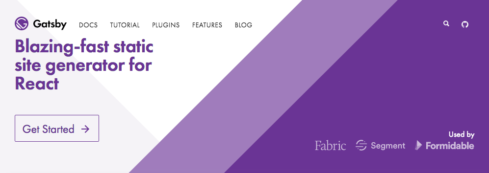
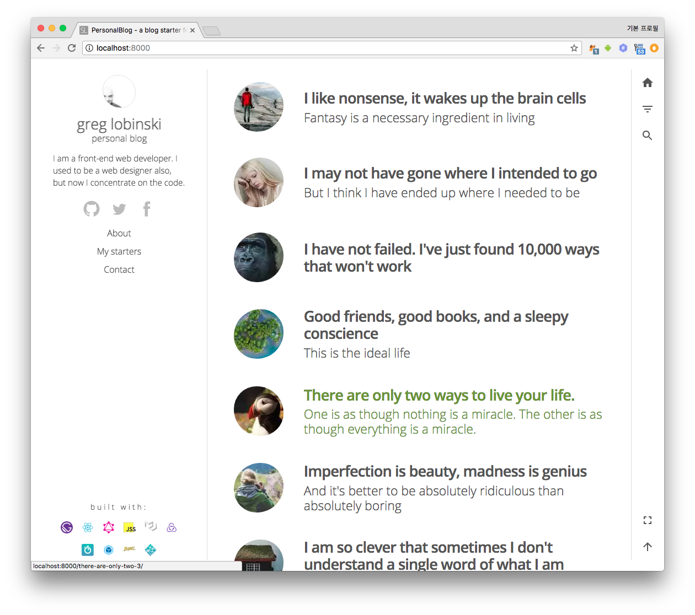
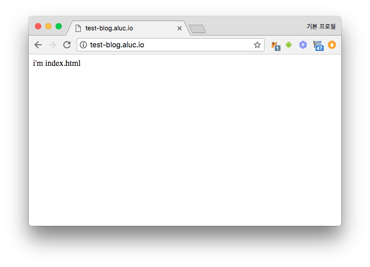

[Gatsby][gatsby] is **Blazing-fast static site generator for React**

라고 공식 사이트에서 설명하고 있다. 정말 빠른지는 다른 static site generator 와
비교를 해봐야겠고, 먼저 gatsby 를 선택한 이유는,

- [StaticGen][static_gen] 에서 top 5 안에 드는 높은 github star 를 가졌고,
- 템플릿 엔진으로 [React][react] 를 사용한다.

[React][react] 를 정적 템플릿 엔진으로만 사용 할 수도 있지만 프론트엔드 View
Layer 구현 라이브러리로서 굉장히 강력하고 기능도 많다. 따라서 이후에 신규
기능이나 디자인을 퍼포먼스 최적화 하면서 추가하기 용이하고 EJS 와 같은 템플릿
엔진뿐만 아니라 [Angular][angular], [Vuejs][vuejs] 조차도 따라올 수 없는 가장 큰
에코시스템을 확보하고 있다. 내가 원하는 컴포넌트를 누군가가 잘 만들어 [npm][npm]
에 올려놓았을 기대를 할 수 있으며 문제가 생겼을때 Stackover flow 에서 모범 답을
찾을 수 있는 확률이 크며 다룰수 있는 개발자를 구하기가 쉽다는 의미이기도 하다.

# 1. Gatsby 프로젝트 개발환경 준비

## 1.1. Gatsby 설치
```sh
$ yarn global add gatsby-cli
```

## 1.2. Gatsby 프로젝트 생성
Gatsby 프로젝트를 생성하려면 gatsby starter 를 선택해야한다. starter 는 gatsby
로 만들 static site 의 기초 틀이다.  상품 소개 웹 사이트를 만들것 인지, 블로그를
만들것 인지, 용도에 맞는 starter 를 선택해서 사용하면 되는데 공식 가이드의
[starters][starters] 에서 demo 를 보면서 선택할 수 있다.

`gatsby new` 명령어를 통해 프로젝틀르 생성하는데 여기에 starter 의 github 저장소
주소를 입력해야한다.  나는 [gatsby-starter-personal-blog][personal_blog_starter]
starter 를 선택했다.  생략하면 [default starter][default_starter] 가 선택된다.
`my-blog` 라는 디렉토리가 생성되고 npm 모듈들이 설치된다.  `gatsby new` 명령어를
통해서 프로젝트를 생성하자.

```sh
$ gatsby new my-blog https://github.com/greglobinski/gatsby-starter-personal-blog
```

```sh
info Creating new site from git: https://github.com/greglobinski/gatsby-starter-personal-blog.git
Cloning into 'my-blog'...
remote: Counting objects: 1704, done.
remote: Compressing objects: 100% (14/14), done.
remote: Total 1704 (delta 2), reused 14 (delta 2), pack-reused 1686
Receiving objects: 100% (1704/1704), 4.44 MiB | 264.00 KiB/s, done.
Resolving deltas: 100% (999/999), done.
success Created starter directory layout
info Installing packages...
yarn install v1.5.1
[1/4] 🔍  Resolving packages...
[2/4] 🚚  Fetching packages...
warning multiyargs@1.0.0: The engine "yargs" appears to be invalid.
[3/4] 🔗  Linking dependencies...
warning "gatsby > postcss-cssnext@2.11.0" has unmet peer dependency "caniuse-db@^1.0.30000652".
warning "gatsby-plugin-jss > react-jss@7.2.0" has unmet peer dependency "react@>=0.13".
warning "gatsby-plugin-jss > react-jss > theming@1.3.0" has unmet peer dependency "react@>=0.15".
warning "gatsby-transformer-remark > graphql-type-json@0.1.4" has unmet peer dependency "graphql@>=0.4.0".
warning " > material-ui@1.0.0-beta.36" has unmet peer dependency "react@^15.3.0 || ^16.0.0".
warning " > material-ui@1.0.0-beta.36" has unmet peer dependency "react-dom@^15.3.0 || ^16.0.0".
warning "material-ui > react-event-listener@0.5.3" has unmet peer dependency "react@^15.3.0 || ^16.0.0".
warning "material-ui > react-jss@8.3.0" has unmet peer dependency "react@>=0.13".
warning "material-ui > react-popper@0.8.2" has unmet peer dependency "react@0.14.x || ^15.0.0 || ^16.0.0".
warning "material-ui > react-popper@0.8.2" has unmet peer dependency "react-dom@0.14.x || ^15.0.0 || ^16.0.0".
warning "material-ui > react-scrollbar-size@2.1.0" has unmet peer dependency "react@^15.3.0 || ^16.0.0".
warning "material-ui > react-transition-group@2.2.1" has unmet peer dependency "react@>=15.0.0".
warning "material-ui > react-transition-group@2.2.1" has unmet peer dependency "react-dom@>=15.0.0".
warning "material-ui > recompose@0.26.0" has unmet peer dependency "react@^0.14.0 || ^15.0.0 || ^16.0.0".
warning " > material-ui-icons@1.0.0-beta.36" has unmet peer dependency "react@^15.3.0 || ^16.0.0".
warning " > material-ui-icons@1.0.0-beta.36" has unmet peer dependency "react-dom@^15.3.0 || ^16.0.0".
warning " > react-custom-scrollbars@4.2.1" has unmet peer dependency "react@^0.14.0 || ^15.0.0 || ^16.0.0".
warning " > react-custom-scrollbars@4.2.1" has unmet peer dependency "react-dom@^0.14.0 || ^15.0.0 || ^16.0.0".
warning " > react-disqus-comments@1.1.1" has unmet peer dependency "react@^15.0.1".
warning " > react-disqus-comments@1.1.1" has unmet peer dependency "react-dom@^15.0.1".
warning " > react-facebook@5.0.3" has unmet peer dependency "react@15.x || 16.x".
warning "react-facebook > react-spinner-children@1.0.8" has unmet peer dependency "react@15.x || 16.x".
warning " > react-headroom@2.2.2" has unmet peer dependency "react@*".
warning " > react-helmet@5.2.0" has unmet peer dependency "react@>=15.0.0".
warning " > react-lazyload@2.3.0" has unmet peer dependency "react@^0.14.0 || ^15.0.0 || ^16.0.0".
warning " > react-lazyload@2.3.0" has unmet peer dependency "react-dom@^0.14.0 || ^15.0.0 || ^16.0.0".
warning " > react-loadable@5.3.1" has unmet peer dependency "react@*".
warning " > react-loadable-visibility@2.4.2" has unmet peer dependency "react@>=15.4.0".
warning " > react-material-ui-form-validator@2.0.0-beta.4" has incorrect peer dependency "material-ui@next".
warning " > react-material-ui-form-validator@2.0.0-beta.4" has unmet peer dependency "react@^15.0.0 || ^16.0.0".
warning " > react-material-ui-form-validator@2.0.0-beta.4" has unmet peer dependency "react-dom@^15.0.0 || ^16.0.0".
warning " > react-material-ui-form-validator@2.0.0-beta.4" has unmet peer dependency "prop-types@^15.0.0".
warning "react-material-ui-form-validator > react-form-validator-core@0.4.1" has unmet peer dependency "react@^15.0.0 || ^16.0.0".
warning "react-material-ui-form-validator > react-form-validator-core@0.4.1" has unmet peer dependency "react-dom@^15.0.0 || ^16.0.0".
warning "react-material-ui-form-validator > react-form-validator-core@0.4.1" has unmet peer dependency "prop-types@^15.0.0".
warning " > react-popper@0.9.2" has unmet peer dependency "react@0.14.x || ^15.0.0 || ^16.0.0".
warning " > react-popper@0.9.2" has unmet peer dependency "react-dom@0.14.x || ^15.0.0 || ^16.0.0".
warning " > react-redux@5.0.7" has unmet peer dependency "react@^0.14.0 || ^15.0.0-0 || ^16.0.0-0".
warning " > react-share@2.1.0" has unmet peer dependency "react@^0.13.0 || ^0.14.0 || ^15.0.0 || ^16.0.0-0".
warning " > eslint-plugin-graphql@1.5.0" has unmet peer dependency "graphql@^0.10.1 || ^0.11.0".
warning Workspaces can only be enabled in private projects.
warning Workspaces can only be enabled in private projects.
[4/4] 📃  Building fresh packages...
✨  Done in 88.47s.
```

`my-blog` 라는 디렉토리가 생성되고 그 아래 npm 을 통해 모듈들이 설치된다.
starter 에서 사용하는 모듈들의 버전이 오래되어 워닝이 좀 나지만 잘 설치되었다.

## 1.3. 개발서버 실행
```sh
$ cd my-blog
$ gatsby develop
success delete html and css files from previous builds — 0.008 s
success open and validate gatsby-config.js — 0.010 s
success copy gatsby files — 0.037 s
success onPreBootstrap — 0.960 s
success source and transform nodes — 0.542 s
success building schema — 0.455 s
success createLayouts — 0.011 s
success createPages — 0.099 s
success createPagesStatefully — 0.022 s
success onPreExtractQueries — 0.003 s
success update schema — 0.236 s
success extract queries from components — 0.176 s
success run graphql queries — 3.844 s
success write out page data — 0.009 s
success write out redirect data — 0.005 s
Generating image thumbnails [==============================] 443/443 21.7 secs 100%

info bootstrap finished - 27.566 s

success onPostBootstrap — 0.003 s
 DONE  Compiled successfully in 16423ms                                                                       00:58:04


You can now view gatsby-starter-personal-blog in the browser.

  http://localhost:8000/

View GraphiQL, an in-browser IDE, to explore your site's data and schema

  http://localhost:8000/___graphql

Note that the development build is not optimized.
To create a production build, use gatsby build
```

브라우저로 `http://localhost:8000/` 접속하면 `starter` 데모에서 보던 웹사이트가
나오는데 샘플 블로그 포스트들도 볼 수 있다.



# 2. AWS Infrastructure 준비
gatsby 를 통해 생성된 static web site 를 public open 된 S3 버킷에 업로드 하고,
route53 에서 해당 버킷으로 트래픽을 보내 인스턴스를 사용하지 않고 static website
를 만드는 것이 이 포스트의 목표이다.

## 2.1. Terraform 설정 파일 작성
[Terraform][terraform] 을 사용하여 AWS S3 와 route53 설정을 하고 gatsby 의
산출물을 올리기 전에 `index.html` 과 `404.html` 임시로 2개의 파일을 올려 인프라
설정 단위만을 테스트 해보자.

main.tf 파일을 아래와 같이 준비하자.
```tf
variable "BUCKET_NAME" {}
variable "ROUTE53_ZONE_NAME" {}
variable "SUB_DOMAIN" {}

resource "aws_s3_bucket" "main" {
  bucket = "${var.BUCKET_NAME}"
  acl    = "public-read"
  website {
    index_document = "index.html"
    error_document = "404.html"
  }
  policy = <<EOF
{
  "Version": "2012-10-17",
  "Statement": [{
    "Effect": "Allow",
    "Principal": "*",
    "Action": "s3:GetObject",
    "Resource": "arn:aws:s3:::${var.BUCKET_NAME}/*"
  }]
}
EOF
}

data "aws_route53_zone" "main" {
  name         = "${var.ROUTE53_ZONE_NAME}."
  private_zone = false
}

resource "aws_route53_record" "main" {
  zone_id = "${data.aws_route53_zone.main.zone_id}"
  name    = "${var.BLOG_DOMAIN}"
  type    = "A"
  alias {
     name = "${aws_s3_bucket.main.website_domain}"
     zone_id = "${aws_s3_bucket.main.hosted_zone_id}"
     evaluate_target_health = true
   }
}
```

[Terraform][terraform] 은 Infrastructure as code 를 구현할 수 있는 좋은
도구이다.  위와 같은 파일을 `apply` 하면 코드에 정의된 설정으로 S3 버킷을 하나
만들고 route53 에 서브 도메인 하나가 이 버킷을 바라보도록 `record` 하나를
생성한다.  Terraform 의 대한 기본 사용법이나 자세한 설명은 다른 [공식
가이드][terraform_official_doc] 또는 다른 블로그를 참고하길..! (구글링 키워드:
[terraform 설명][googling_keyword])

## 2.2. 환경변수 파일 준비
`main.tf` Terraform 구성파일을 보면 `var.xx` 라는 변수를 사용한다. 이 변수는
terraform 을 실행할때 환경변수를 통해 셋팅해 줄 수 있는데 환경변수 정의 파일을
`.envrc` 라는 파일이름으로 아래와 같이 작성하자.

```sh
# Terraform 이 AWS 리소스를 생성할때 사용할 access key와 secret key
# `~/.aws/credentials` 쪽을 사용하는 방법도 있다.
export AWS_ACCESS_KEY_ID=AKXXXXXXXXXXXXXXXXRA
export AWS_SECRET_ACCESS_KEY=kvxxxxxxxxxxxxxxxxxxxxxxxxxxxxxxxxxxxxzZ

# Terraform 이 AWS 리소스를 생성할 리전
export AWS_DEFAULT_REGION=ap-northeast-2

# route53 에서 관리하고 있는 public domain 의 이름
export TF_VAR_ROUTE53_ZONE_NAME=aluc.io

# blog domain 이름. 위 TF_VAR_ROUTE53_ZONE_NAME 에 선언한 public domain 과
# 동일하거나 public domain 의 서브 도메인 이어야 한다.
export TF_VAR_BLOG_DOMAIN=test-blog.aluc.io

# static 파일을 올리고 route53 을 통해 서비스할 버킷이름
# 지금은 일단 TF_VAR_BLOG_DOMAIN 과 같은 이름으로 해야한다.
export TF_VAR_BUCKET_NAME=test-blog.aluc.io
```

아래 명령어로 환경 변수를 현재 쉘에 셋팅하자.

```sh
$ source .envrc
```

> 꿀팁! [direnv][direnv] 를 사용하면 현재 디렉토리의 `.envrc` 파일에 따라 자동으로 환경변수를 셋팅해준다.

## 2.3. Terraform apply
이제 Terraform `apply` 명령으로 `main.tf` 파일의 구성 내용을 실제 AWS 환경에
렌더해보자.

```sh
$ terraform apply
data.aws_route53_zone.main: Refreshing state...

An execution plan has been generated and is shown below.
Resource actions are indicated with the following symbols:
  + create

Terraform will perform the following actions:

  + aws_route53_record.main
      id:                                      <computed>
      alias.#:                                 "1"
      alias.~708148744.evaluate_target_health: "true"
      alias.~708148744.name:                   "${aws_s3_bucket.main.website_domain}"
      alias.~708148744.zone_id:                "${aws_s3_bucket.main.hosted_zone_id}"
      allow_overwrite:                         "true"
      fqdn:                                    <computed>
      name:                                    "test-blog.aluc.io"
      type:                                    "A"
      zone_id:                                 "Z3XXXXXXXXXXWA"

  + aws_s3_bucket.main
      id:                                      <computed>
      acceleration_status:                     <computed>
      acl:                                     "public-read"
      arn:                                     <computed>
      bucket:                                  "test-blog.aluc.io"
      bucket_domain_name:                      <computed>
      force_destroy:                           "false"
      hosted_zone_id:                          <computed>
      policy:                                  "{\n  \"Version\": \"2012-10-17\",\n  \"Statement\": [\n    {\n      \"Effect\": \"Allow\",\n      \"Principal\": \"*\",\n      \"Action\": \"s3:GetObject\",\n      \"Resource\": \"arn:aws:s3:::test-blog.aluc.io/*\"\n    }\n  ]\n}\n"
      region:                                  <computed>
      request_payer:                           <computed>
      versioning.#:                            <computed>
      website.#:                               "1"
      website.0.error_document:                "404.html"
      website.0.index_document:                "index.html"
      website_domain:                          <computed>
      website_endpoint:                        <computed>


Plan: 2 to add, 0 to change, 0 to destroy.

Do you want to perform these actions?
  Terraform will perform the actions described above.
  Only 'yes' will be accepted to approve.

  Enter a value:
```

`terraform apply` 명령어는 실제 인프라에 적용하기 전에 자원들의 변경 `plan` 을
검토 할 수 있게 리포트해준다. 위 output 에 따르면 아래 2개 자원이 생성된다.
```diff
+ aws_route53_record.main
+ aws_s3_bucket.main
```

terraform 을 처음 입문할때의 실수로 의도치 않게 자원을 destroy 하거나 다른
정보로 덮어쓰는 실수를 자주 하게 되니 반드시 `yes` 타이핑 하기전 어떤 자원들이
생성/변경/소멸 되는지 철저하게 리뷰해야한다.

리뷰 후 `yes` 를 타이핑 하여 실제 AWS 환경에 자원을 생성하자.
```sh
  Enter a value: yes

aws_s3_bucket.main: Creating...
  acceleration_status:      "" => "<computed>"
  acl:                      "" => "public-read"
  arn:                      "" => "<computed>"
  bucket:                   "" => "test-blog.aluc.io"
  bucket_domain_name:       "" => "<computed>"
  force_destroy:            "" => "false"
  hosted_zone_id:           "" => "<computed>"
  policy:                   "" => "{\n  \"Version\": \"2012-10-17\",\n  \"Statement\": [\n    {\n      \"Effect\": \"Allow\",\n      \"Principal\": \"*\",\n      \"Action\": \"s3:GetObject\",\n      \"Resource\": \"arn:aws:s3:::test-blog.aluc.io/*\"\n    }\n  ]\n}\n"
  region:                   "" => "<computed>"
  request_payer:            "" => "<computed>"
  versioning.#:             "" => "<computed>"
  website.#:                "" => "1"
  website.0.error_document: "" => "404.html"
  website.0.index_document: "" => "index.html"
  website_domain:           "" => "<computed>"
  website_endpoint:         "" => "<computed>"
aws_s3_bucket.main: Creation complete after 8s (ID: test-blog.aluc.io)
aws_route53_record.main: Creating...
  alias.#:                                 "" => "1"
  alias.1390227693.evaluate_target_health: "" => "true"
  alias.1390227693.name:                   "" => "s3-website.ap-northeast-2.amazonaws.com"
  alias.1390227693.zone_id:                "" => "Z3XXXXXXXXXXYP"
  allow_overwrite:                         "" => "true"
  fqdn:                                    "" => "<computed>"
  name:                                    "" => "test-blog.aluc.io"
  type:                                    "" => "A"
  zone_id:                                 "" => "Z3XXXXXXXXXXWA"
aws_route53_record.main: Still creating... (10s elapsed)
aws_route53_record.main: Still creating... (20s elapsed)
aws_route53_record.main: Still creating... (30s elapsed)
aws_route53_record.main: Still creating... (40s elapsed)
aws_route53_record.main: Still creating... (50s elapsed)
aws_route53_record.main: Creation complete after 55s (ID: Z3XXXXXXXXXXWA_test-blog.aluc.io_A)

Apply complete! Resources: 2 added, 0 changed, 0 destroyed.
```

## 2.4. 인프라 셋업 확인
에러 없이 잘 실행되었다면 `index.html`, `404.html` 파일을 임시로 만들어 생성된
S3 버킷에 올려보자.

index.html 내용:
```html
<html><body>i'm index.html</body></html>
```

404.html 내용:
```html
<html><body>i'm 404.html</body></html>
```

```sh
$ aws s3 cp index.html s3://$TF_VAR_BUCKET_NAME/
$ aws s3 cp 404.html s3://$TF_VAR_BUCKET_NAME/
```

브라우저로 `$TF_VAR_BLOG_DOMAIN` 에 접속해보자.

`index.html` 확인:
```sh
open http://$TF_VAR_BLOG_DOMAIN
```

`404.html` 확인:
```sh
open http://$TF_VAR_BLOG_DOMAIN/some-wrong-path
```




# 3. Gatsby 블로그 배포
임시 `index.html` 파일을 올려 인프라 구성이 잘 되었는지 확인했다면 실제 Gatsby
프로젝트르 빌드 하여 산출물인 Static site 파일들을 S3 에 업로드 하여 Gatsby
프로젝트를 배포해보자.

## 3.1. build
```sh
$ gatsby build

success delete html and css files from previous builds — 0.012 s
success open and validate gatsby-config.js — 0.008 s
info One or more of your plugins have changed since the last time you ran Gatsby. As
a precaution, we're deleting your site's cache to ensure there's not any stale
data
success copy gatsby files — 0.021 s
success onPreBootstrap — 0.799 s
success source and transform nodes — 0.235 s
success building schema — 0.358 s
success createLayouts — 0.010 s
success createPages — 0.047 s
success createPagesStatefully — 0.015 s
success onPreExtractQueries — 0.004 s
success update schema — 0.218 s
success extract queries from components — 0.187 s
success run graphql queries — 1.007 s
success write out page data — 0.009 s
success write out redirect data — 0.168 s
Generating image thumbnails [==============================] 45/45 7.1 secs 100%

info bootstrap finished - 11.941 s

success onPostBootstrap — 0.002 s
success Building CSS — 12.495 s
success Building production JavaScript bundles — 29.929 s
success Building static HTML for pages — 12.074 s
error UNHANDLED EXCEPTION


  AlgoliaSearchError: Please provide an API key. Usage: algoliasearch(applicationID, apiKey, opts)

  - AlgoliaSearchCore.js:55 AlgoliaSearchNodeJS.AlgoliaSearchCore
    [aluc.io]/[algoliasearch]/src/AlgoliaSearchCore.js:55:11

  - AlgoliaSearch.js:11 AlgoliaSearchNodeJS.AlgoliaSearch
    [aluc.io]/[algoliasearch]/src/AlgoliaSearch.js:11:21

  - AlgoliaSearchServer.js:17 AlgoliaSearchNodeJS.AlgoliaSearchServer
    [aluc.io]/[algoliasearch]/src/server/builds/AlgoliaSearchServer.js:17:17

  - node.js:79 new AlgoliaSearchNodeJS
    [aluc.io]/[algoliasearch]/src/server/builds/node.js:79:23

  - node.js:68 algoliasearch
    [aluc.io]/[algoliasearch]/src/server/builds/node.js:68:10

  - gatsby-node.js:8 Object.exports.onPostBuild
    [aluc.io]/[gatsby-plugin-algolia]/gatsby-node.js:8:18

  - api-runner-node.js:110 runAPI
    [aluc.io]/[gatsby]/dist/utils/api-runner-node.js:110:36

  - api-runner-node.js:187
    [aluc.io]/[gatsby]/dist/utils/api-runner-node.js:187:33

  - map.js:27
    [aluc.io]/[gatsby]/[async]/internal/map.js:27:9

  - eachOfLimit.js:64 replenish
    [aluc.io]/[gatsby]/[async]/internal/eachOfLimit.js:64:17

  - eachOfLimit.js:49 iterateeCallback
    [aluc.io]/[gatsby]/[async]/internal/eachOfLimit.js:49:17

  - onlyOnce.js:12
    [aluc.io]/[gatsby]/[async]/internal/onlyOnce.js:12:16

  - map.js:29
    [aluc.io]/[gatsby]/[async]/internal/map.js:29:13

  - util.js:16 tryCatcher
    [aluc.io]/[bluebird]/js/release/util.js:16:23

  - nodeify.js:23 Promise.successAdapter
    [aluc.io]/[bluebird]/js/release/nodeify.js:23:30

  - promise.js:566 Promise._settlePromise
    [aluc.io]/[bluebird]/js/release/promise.js:566:21

  - promise.js:606 Promise._settlePromiseCtx
    [aluc.io]/[bluebird]/js/release/promise.js:606:10

  - async.js:138 Async._drainQueue
    [aluc.io]/[bluebird]/js/release/async.js:138:12

  - async.js:143 Async._drainQueues
    [aluc.io]/[bluebird]/js/release/async.js:143:10

  - async.js:17 Immediate.Async.drainQueues [as _onImmediate]
    [aluc.io]/[bluebird]/js/release/async.js:17:14
```

어떤 Gatsby starter 를 사용했냐에 따라 결과 조금 다를 수 있다.  내가 선택한
[gatsby-starter-personal-blog][personal_blog_starter] starter 는 배포시 algolia
관련 에러가 나지만 algolia 적용은 다른 포스트에서 따로 다루기로 하고 지금은 우선
무시해도 좋다.

## 3.2. S3 로 배포
build 산출물은 모두 `public` 디렉토리에 저장된다. S3 에 올리자.  S3 버킷이름을
직접 사용하지 않고 `2.2.` 에서 셋팅한 환경변수를 사용한다.
```sh
$ aws s3 cp --recursive public s3://$TF_VAR_BUCKET_NAME/
```

브라우저로 업로드된 static website 가 잘 나오는지 접속해보자.
```sh
open http://$TF_VAR_BLOG_DOMAIN
```

# 4. 첨언
포스트에 사용한 툴들은 서로 디펜던시가 없다. 예를들어 terraform 을 모르고
사용하고 싶지도 않다면 직접 AWS Console 을 통해 S3 와 route53 설정을 해도 아무
문제가 없다. `aws` CLI 명령어를 모르면 역시 다른 툴로 upload 를 해도 무방하다.
또한 같은 방법으로 gatsby 가 아닌 다른 정적 사이트 생성엔진의 산출물을 올려도 잘
동작할 것이다.

[gatsby]: https://www.gatsbyjs.org/
[static_gen]: https://www.staticgen.com/
[react]: https://reactjs.org/
[angular]: https://angular.io/
[vuejs]: https://vuejs.org/
[npm]: https://www.npmjs.com/
[gatsby_get_started]: https://www.gatsbyjs.org/docs/
[default_starter]: https://github.com/gatsbyjs/gatsby-starter-default
[starters]: https://www.gatsbyjs.org/docs/gatsby-starters/
[personal_blog_starter]: https://github.com/greglobinski/gatsby-starter-personal-blog
[terraform]: https://www.terraform.io/
[terraform_official_doc]: https://www.terraform.io/docs/index.html
[googling_keyword]: https://www.google.co.kr/search?ei=9ZPTWquLFMOc8QWq67q4Cg&q=terraform+%EC%84%A4%EB%AA%85&oq=terraform+%EC%84%A4%EB%AA%85
[direnv]: https://direnv.net/
