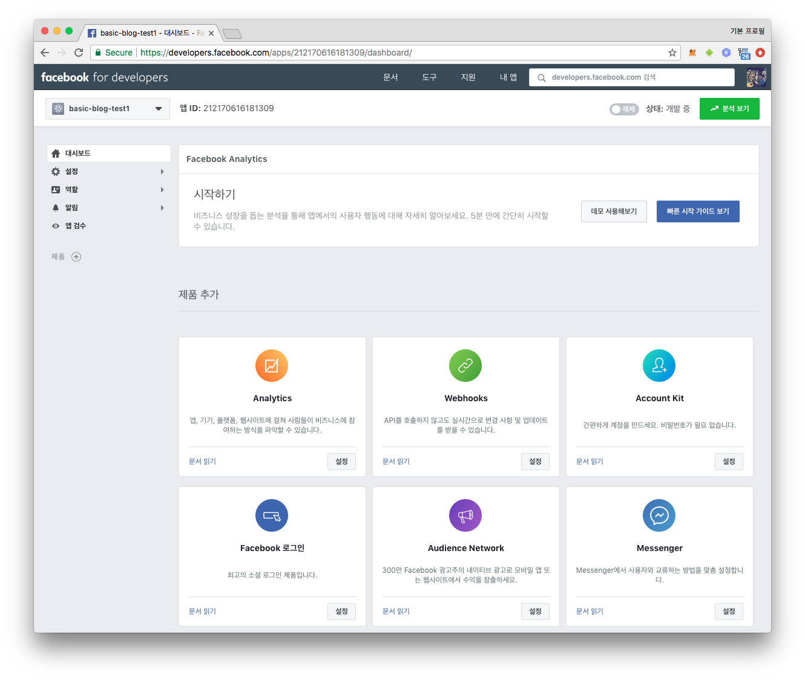
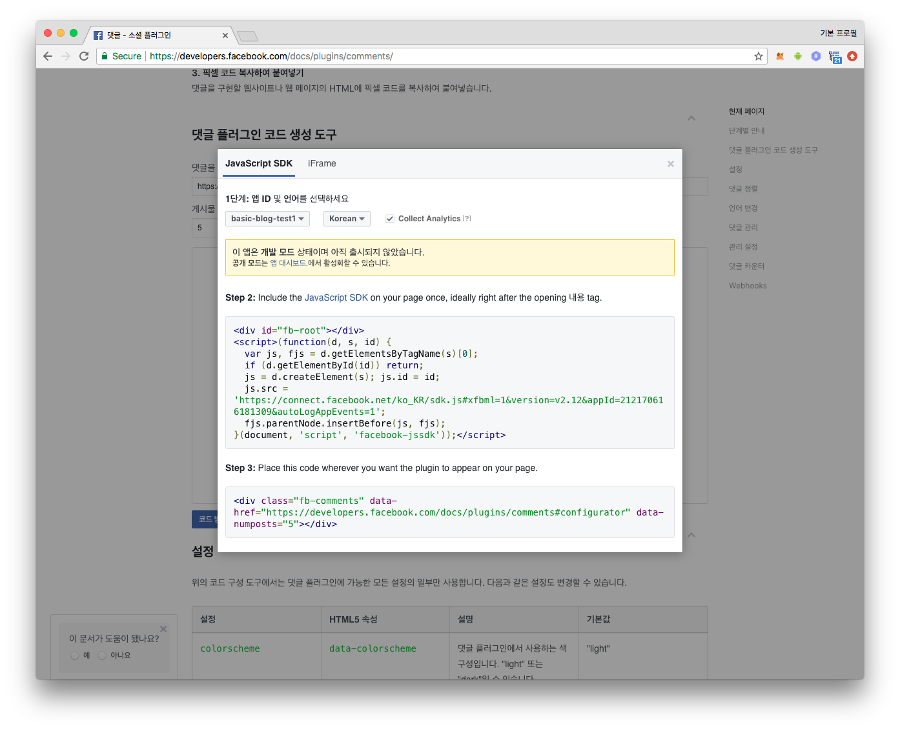
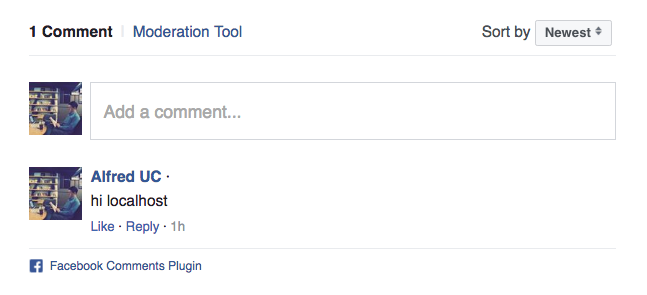

지난번 AWS S3 를 사용하여 [Gatsby blog][gatsby_blog_1] 를 배포하는 포스트에 이어
gatsby 블로그에 페이스북 소셜 댓글 플러그인을 달아보자. 사실 지난번 포스트에
사용했던 [Gatsby personal blog starter][starters] 는 이미 해당 기능이 탑재가
되어 있어서 `Facebook App ID` 만 있으면 쉽게 소셜 댓글 플러그인을 바로 설치 할
수 있다. 하지만 여기에서는 소셜 댓글 플러그인이 탑재되지 않은
[gatsby-starter-blog][gatsby_starter_blog] 를 사용해 직접 페이스북 소셜 댓글
플러그인을 설치해보자.

# 1. Gatsby 프로젝트 생성
gatsby 설치 및 starter 에 관한 내용은 [이전 포스트][gatsby_blog_1] 를 참고하고
여기에서는 바로 프로젝트 생성부터 시작한다.

프로젝트 생성 및 개발서버 실행:
```sh
$ gatsby new basic-blog https://github.com/gatsbyjs/gatsby-starter-blog
$ cd basic-blog
$ gatsby develop
```

# 2. 앱 생성
페이스북 서비스를 사용하려면 [페이스북 개발자 지원 페이지][facebook_apps]에서
`앱` 을 생성한후 나오는 `App ID` 가 필요하다. 대쉬보드 페이지 상단에서 찾을 수
있다. 



복사해두자.

# 3. react-facebook
페이스북 댓글 플러그인은 웹 사이트에 Html 코드와 `<div id="fb-root"></div>` 와
자바스크립트 코드를 삽입하면 `<iframe>` 을 통해 서비스가 로드된다. [공식
가이드][official_comment_guide]를 보면 아래와 같이 삽입할 코드를 확인할 수 있다.



**gatsby** 는 **React** 를 사용하므로 위의 코드를 직접 사용하는 것보다 React
컴포넌트화된 라이브러리를 사용하는 것이 편리할 것 이다. 오픈소스 React facebook
컴포넌트인 [react-facebook][react_facebook] 을 사용하자. 댓글 뿐만 아니라
**공유하기 버튼**, **좋아요 버튼** 등 여러 컴포넌트가 구현되어있다.

```sh
$ yarn add react-facebook
```

라이브러리를 설치하고 [react-facebook][react_facebook] 의 가이드를 참고하여
포스트 페이지 템플릿 파일 적당한 곳에 아래 코드를 추가하면 된다.

```js
<FacebookProvider appId="123456789">
  <Comments href="http://www.facebook.com" />
</FacebookProvider>
```

다만 이때 필요한 `appId` 와 `href` 값을 실제 자기 블로그의 값으로 변경해야하고
위처럼 직접 코드에 삽입하는 방식보다는 환경변수로 따로 관리하는 방법이
바람직하다.

# 4. 구현
간단한 구현이지만 환경변수 셋팅, graphQL 을 사용하여 환경변수에 접근하는 부분
위주로 설명을 이어간다.

## 4.1. 환경변수 준비
  프로젝트 루트 디렉토리에 `.envrc` 라는 파일이름으로
아래와 같은 환경변수 파일을 만들자.
```sh
export MYBLOG_SITE_URL=http://basic-blog.aluc.io
export MYBLOG_FACEBOOK_APP_ID=212888888888309
```

`gatsby develop` 로 구동되는 개발서버를 잠시 중지시키고 환경변수를 현재 쉘에
셋팅하고 다시 개발서버를 실행하자.
```sh
$ source .envrc
$ gatsby develop
```

> `.envrc` 파일이 형상관리에 포함되지 않도록 `.gitignore` 파일에 추가 해야한다.

## 4.2. 환경변수에 접근하여 siteMetadata 수정
nodejs 에서 환경변수는 `process.env` 오브젝트에 접근하여 사용할 수 있다.
`gatsby-config.js` 파일을 아래와 같이 수정하자.
```js
module.exports = {
   siteMetadata: {
     title: 'Gatsby Starter Blog',
     author: 'Kyle Mathews',
     description: 'A starter blog demonstrating what Gatsby can do.',
-    siteUrl: 'https://gatsbyjs.github.io/gatsby-starter-blog/',
+    siteUrl: process.env.MYBLOG_SITE_URL,
+    facebookAppId: process.env.MYBLOG_FACEBOOK_APP_ID,
   },
   pathPrefix: '/gatsby-starter-blog',
   plugins: [
```

## 4.3. GraphGL 사용하여 siteMetadata 접근
포스트 페이지 템플릿인 `src/templates/blog-post.js` 파일에 `react-facebook`
컴포넌트를 추가해보자. 우선 `appId` 와 `href` 값에 사용할 데이터를 받기 위해
GraphQL 쿼리에 아래와 같이 필드를 추가하자:

```diff
export const pageQuery = graphql`
  query BlogPostBySlug($slug: String!) {
    site {
      siteMetadata {
        title
        author
+       siteUrl
+       facebookAppId
      }
    }
    markdownRemark(fields: { slug: { eq: $slug } }) {
      id
      html
+     fields {
+       slug
+     }
      frontmatter {
        title
        date(formatString: "MMMM DD, YYYY")
      }
    }
  }
`
```

GraphQL 로 반환된 데이터를 `render()` 함수에서 받아보자.

```diff
   render() {
     const post = this.props.data.markdownRemark
     const siteTitle = get(this.props, 'data.site.siteMetadata.title')
+    const siteUrl = get(this.props, 'data.site.siteMetadata.siteUrl')
+    const facebookAppId = get(this.props, 'data.site.siteMetadata.facebookAppId')
+    const slug = get(this.props, 'data.markdownRemark.fields.slug')
     const { previous, next } = this.props.pathContext
+    const postUrl = urljoin(siteUrl, slug)
     ...
```

slug 는 사이트의 특정 페이지의 `path` 라고 보면된다. `siteUrl` 마지막에 `/` 가
포함될 수 있고 `slug` 값 앞에도 `/` 가 포함될 수 있다. 두 값을 이어 붙여
facebook 댓글 컴포넌트에 사용할 `href` 을 만드는데 `http://a.b.c//my-first-post`
와 같이 중간에 `/` 가 2개 나타난다. 이를 해결하기위해 [url-join][url_join] 을
사용했다. 따라서 import 부분에 아래 라인들이 추가된다.

```diff
+import urljoin from 'url-join'
+import FacebookProvider, { Comments } from 'react-facebook';
```

## 4.4. react-facebook 추가
적당한 곳에 아래 코드를 추가하자.

```diff
         <Bio />

+        <FacebookProvider appId={facebookAppId}>
+          <Comments href={postUrl} />
+        </FacebookProvider>
         <ul
           style={{
```

# 5. Test
브라우저로 `http://localhost:8000/` 에 접속하여 확인해보고 댓글도 남겨보자.

```sh
$ open localhost:8000/
```

# 6. Moderation Tool
생각해보자, 블로그 사이트에 여러개의 포스트가 있을텐데 각 포스트 페이지에 일일이
접근해서 댓글들을 확인 하는 것은 한계가 있다. 페이스북에서는 댓글 관리도구인
`Moderation Tool` 을 제공한다. 관리 툴은 **앱 기반 관리** 와 **페이지 기반
관리** 가 있는데,

- **페이지 기반 관리**: 각각의 포스트 페이지의 댓글을 관리하는 것이고,
- **앱 기반 관리**: 모든 포스트의 달린 댓글을 한번에 관리하는 것이다.

## 6.1. meta 태그 추가
단, 이 기능을 사용하려면 위에서 생성한 `Facebook App ID` 또는 댓글 관리자들의
페이스북 ID 를 웹 페이지 `<head>` 태그에 추가해줘야 한다. 자세한 설명은
[공식 가이드][official_comment_guide] 에 있으므로 여기서는 App ID 를 추가하는
방법에 대해서만 간단히 알아본다.

이 포스트에서 선택한 [gatsby-starter-blog][gatsby_starter_blog] 는 `<head>` 태그를
관리하는 [react-helmet][react_helmet] 을 사용한다. `src/templates/blog-post.js` 
파일의 `<Helmet>` 부분의 코드를 다음과 같이 수정하자.

```diff
-        <Helmet title={`${post.frontmatter.title} | ${siteTitle}`} />
+        <Helmet>
+          <title>{`${post.frontmatter.title} | ${siteTitle}`}</title>
+          <meta property="fb:app_id" content={facebookAppId} />
+        </Helmet>
```

## 6.2. 웹사이트 퍼블릭 오픈
meta 태그를 추가하여도 아래 화면처럼 `Moderation Tool` 버튼이 보이지 않을 것이다.



페이스북이 위 `href` 에 사용한 url 에 접속하여 `<meta>` 태그의 정보를 **스크랩**하여
웹 페이지의 소유자를 확인 한 후 댓글 관리 기능을 열어 주는 것인데, 지금까지
`gatsby develop` 를 사용해 로컬에서 개발서버를 구동하고 있어서 `localhost` 로
페이지를 볼 수 있지만 페이스북에서는 `href` 로 넘겨준 url (예:
`http://basic-blog.aluc.io/hello-world`) 에 접속 할 수 가 없을 것이다.

[이전 포스트][gatsby_blog_1]를 참고하여 s3 에 파일을 올리고 website 접근
설정하여 퍼블릭 오픈해줘야 페이스북에서 접속 할 수 있고, 페이스에서 제공하는
[공유 디버거][debugger] 를 통해 확인 할 수 있다.

## 6.2. 공유 디버거 사용
[공유 디버거][debugger] 페이지에 방문해 퍼블릭 오픈된 웹 페이지의 주소를
입력하고 `디버그` 버튼을 눌러서 페이스북이 **스크랩** 한 정보를 확인하자. 첫
시도라면 `Facebook에서 공유된 적이 없는 URL입니다.` 라는 메시지가 나오는데 `새
정보 가져오기` 버튼을 눌러 다시 스크랩을 시킬 수 있다.


위의 화면에서 중요한 것은 `응답 코드` 인데 `200` 또는 `206`과 같은 정상
상태여야하고 아래에 `fb:app_id` 값을 잘 스크랩 한 것을 확인 할 수 있어야한다.
확인 후 문제가 있다면 `다시 스크랩` 버튼을 눌러 새 정보로 갱신시킬 수 있다. 잘
스크랩된 것을 확인 한후 개발자 페이지로 돌아가 새로고침 하여 `Moderation Tool`
버튼이 노출되는지 확인하자. 

요약하자면 퍼블릭 오픈된 주소를 `href` 에 넘겨주고 페이스북은 그 주소로 접속해
meta 태그의 정보를 **스크랩** 하여 `Moderation Tool` 버튼 노출 여부를 판단하므로
`localhost` url 을 사용하여 개발서버에 접속을 하여도 상관없이 노출되어야한다.

# 7. 결론, Q&A
마지막 `6.2. 공유 디버거 사용` 부분을 제외하고는 크게 특별한 것은 없다.  이
포스트를 작성하는데 대부분 시간이 `Moderation Tool` 버튼이 나타나지 않아 원인을
찾는데 대부분 할애됐다. 다른 블로그나 stackoverflow 에서 관련 내용을 확인하여
해결하였지만 공식 페이지에 해당 내용이 없는 것이 아쉽다.

공유 디버거에 사이트 주소까지만 하면 안되고 slug 주소까지 모두 입력을 해야
해당 페이지의 뜨는 댓글 플러그인데 `Moderation Tool` 버튼이 뜬다.

- Q. 모든 포스트 페이지마다 공유 디버거에 입력 후 `스크랩 하기` 버튼을
  눌러야 하나?
- A. 아니다. 첫 접근 시 자동으로 스크랩 된다. 다만 매번 `다시 스크랩하기` 를
  하지 않기 때문에 퍼블릭 오픈하기전 `href` 를 제공했으면 스크랩을 실패 했을
  것이고 이 스크랩 결과를 **아마도** 일정 주기 캐시해서 사용하는 것 같다.
  이때 수동으로 `다시 스크랩하기` 를 눌러주면 바로 `Moderation Tool` 버튼을
  볼 수 있다.

# References
- https://developers.facebook.com/docs/plugins/comments/
- http://thdev.net/255
- https://stackoverflow.com/questions/9120814/comments-plugin-moderation-tool-not-working


[gatsby_blog_1]: http://test-blog.aluc.io/gatsby-blog/
[gatsby_starter_blog]: https://github.com/gatsbyjs/gatsby-starter-blog
[facebook_apps]: https://developers.facebook.com/apps/
[react_facebook]: https://github.com/seeden/react-facebook
[url_join]: https://github.com/jfromaniello/url-join
[official_comment_guide]: https://developers.facebook.com/docs/plugins/comments/
[react_helmet]: https://github.com/nfl/react-helmet
[app_based_tool]: https://developers.facebook.com/tools/comments/
[debugger]: https://developers.facebook.com/tools/debug/sharing

