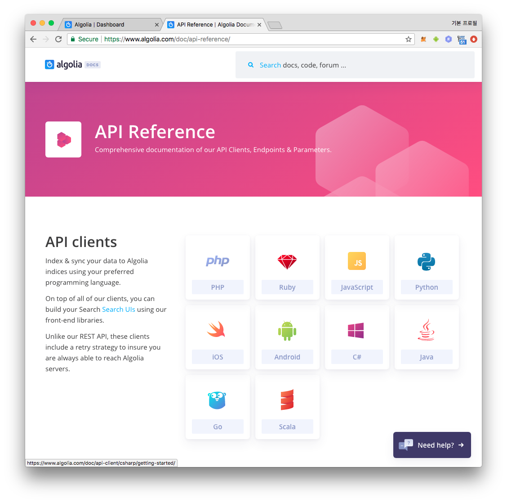
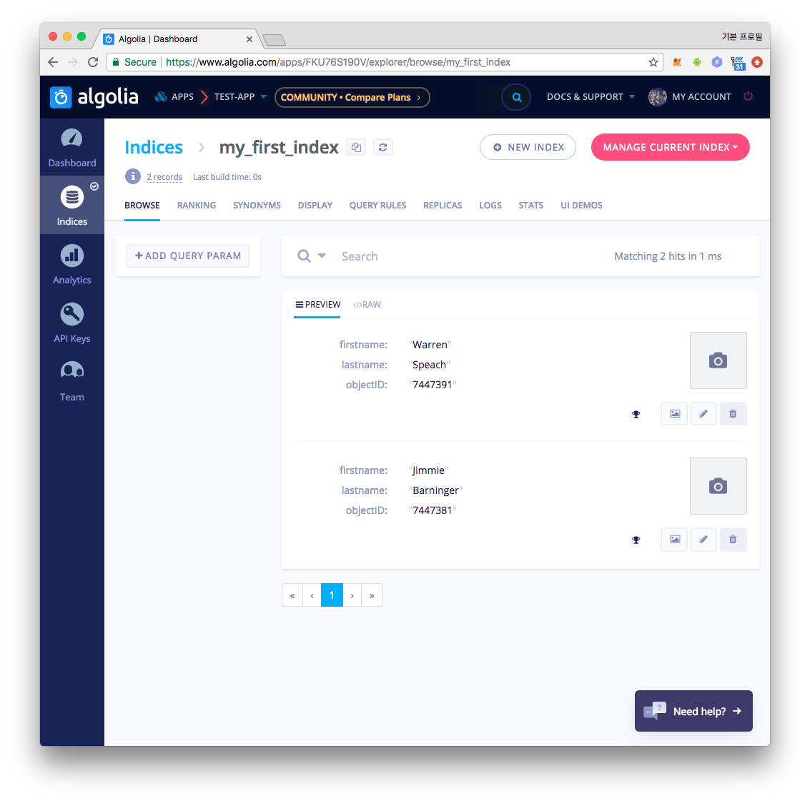
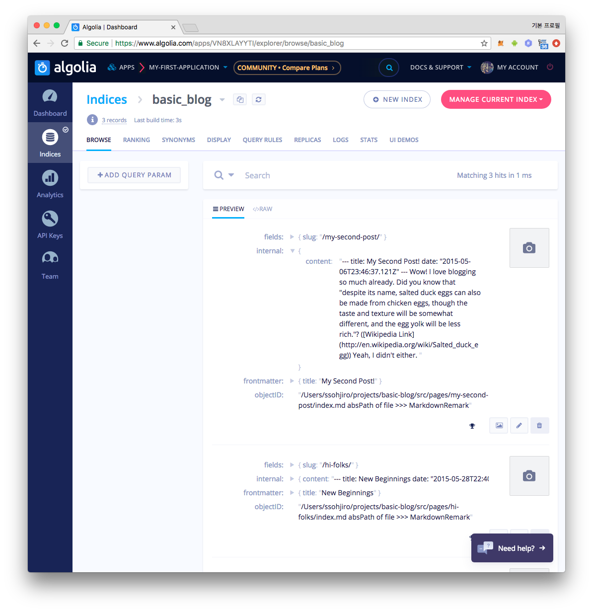

블로그에 검색 기능은 필수이다. [algolia][algolia] 는 SaaS(Service as a service)
형태로 제공되는 검색 서비스, 혹은 관리형 검색 서비스 라고 할 수 있다.

검색 기능을 **제대로** 구현하려면 손이 매우 많이 간다. 디비 설계, 인덱싱,
쿼리작성, 페이지네이션, 캐시, 다국어 지원, 서버 관리, 각종 인프라 관리, 이
모든것에 대한 고가용성까지 고려한다면 누군가 잘 만들어놓은 것을 돈을
지불하고서라도 쓰고 싶다. (무료인 커뮤니티 플랜도 있다)

algolia 가 바로 그 것이다. algolia 제공되는 API 통해 내부에서 관리되는 DB 에
웹사이트의 모든 콘텐츠를 넣어놓고 검색 API 를 통해 요청하면 응답을 준다.
블로그에 그냥 설치하고 넘어가려 했으나 사용성과 성능에 깜짝 놀라 간단하게
포스팅까지 작성하게 되었다.

# 1. algolia 구조
algolia 서비스에서 검색 요청을 하게되면 `Index` 라고 불리는 논리적으로 격리된 DB
기반으로 수행되는데, `Index` 는 하나의 디비 테이블이라고 생각 할 수 있고, 하나의
row 는 `Object` 라고 불리며 `JSON` 데이터로 관리된다. `Index` 까지의 구조를
살펴보면 하나의 App 은 여러개의 `Index` 를 가질 수 있고, 하나의 algolia 계정이
여러개의 App 을 가질 수 있다. App 단위로 Price Plan 을 선택하여 과금되며 검색 UI
에 algolia 로고를 노출하면 무료인 Community 버전을 사용 할 수도 있다.

# 2. Index 에 Object 추가 / 조회
Index 아래 검색이 될 콘텐츠들을 추가해보자. [document 페이지][document]를 보면
algolia 는 아래와 같이 많은 언어를 지원하는 것을 볼 수 있고 SDK 를 제공하여 SDK
를 통해 algolia API 를 사용하는 것이다.



# 2.1. add objects
nodejs 코드로 `Index` 안에 Object 를 추가하는 `add-object.js` 파일을 작성해보자:
```js
const algoliasearch = require('algoliasearch');

const ALGOLIA_APP_ID = process.env.ALGOLIA_APP_ID;
const ALGOLIA_ADMIN_API_KEY = process.env.ALGOLIA_ADMIN_API_KEY;
const ALGOLIA_INDEX_NAME = process.env.ALGOLIA_INDEX_NAME;

const client = algoliasearch(ALGOLIA_APP_ID, ALGOLIA_ADMIN_API_KEY);
const index = client.initIndex(ALGOLIA_INDEX_NAME);
var objects = [{
  firstname: 'Jimmie',
  lastname: 'Barninger'
}, {
  firstname: 'Warren',
  lastname: 'Speach'
}];

index.addObjects(objects, function(err, content) {
  console.log(content);
});
```

위 코드에서 사용한 환경변수 예:
```sh
export ALGOLIA_INDEX_NAME=my_first_index
export ALGOLIA_APP_ID=VXXXXXXXXI
export ALGOLIA_SEARCH_ONLY_API_KEY=f2xxxxxxxxxxxxxxxxxxxxxxxxxxxx87
export ALGOLIA_ADMIN_API_KEY=7dxxxxxxxxxxxxxxxxxxxxxxxxxxxx9c
```

환경변수에 사용한 `APP_ID` 등은 Application 페이지에서 새로운 애플리케이션을
생성하면 `FKU76S190V` 와 같은 `APP_ID` 가 나온다. 그런 다음 키
페이지에서(`https://www.algolia.com/apps/{APP_ID}/api-keys`) 다른 키 들을 확인
할 수 있다.

테스트 환경을 만들어 실행시켜보자.
```sh
$ mkdir algolia-test
$ cd algolia-test
$ echo {} > package.json
$ yarn add algoliasearch
$ vi add-object.js  # 코드작성
$ vi .envrc         # 실제 생성한 APP_ID 등 작성
$ source .envrc
$ node add-object
{ objectIDs: [ '7447381', '7447391' ], taskID: 7676251291 }
```

추가한 object 는 `firstname`, `lastname` 뿐이다. 모든 object 는 식별자로서
`objectID` 를 필수로 가지는데 위의 코드처럼 object 를 생략하는 경우 자동으로
생성된다. objectID 는 `string` 타입이며 `number` 타입으로 작성시 자동으로
`string` 타입으로 형 변환된다. 이 경우 `node get-object` 를 수행 할 때마다
새로운 `objectID` 를 가진 object 가 계속해서 생성된다.

위의 output 을 살펴보면 `[ '7447381', '7447391' ]` 2 개의 `objectID` 를 가진
object 가 생성되었다.

# 2.2. get objects
추가된 object 를 확인하기 위해 `get-object.js` 파일을 작성해보자:
```js
const algoliasearch = require('algoliasearch');

const ALGOLIA_APP_ID = process.env.ALGOLIA_APP_ID;
const ALGOLIA_ADMIN_API_KEY = process.env.ALGOLIA_ADMIN_API_KEY;
const ALGOLIA_INDEX_NAME = process.env.ALGOLIA_INDEX_NAME;

const client = algoliasearch(ALGOLIA_APP_ID, ALGOLIA_ADMIN_API_KEY);
const index = client.initIndex(ALGOLIA_INDEX_NAME);

index.getObjects(['7447381','7447391'], function(err, content) {
  if (err) throw err;

  console.log(JSON.stringify(content,null,2));
});
```


```js
$ node get-object
{
  "results": [
    {
      "firstname": "Jimmie",
      "lastname": "Barninger",
      "objectID": "7447381"
    },
    {
      "firstname": "Warren",
      "lastname": "Speach",
      "objectID": "7447391"
    }
  ]
}
```

[대쉬보드][]를 통해 Web UI 로도 확인 할 수도 있다.



환경변수에 설정한 `my_first_index` 라는 이름의 `Index` 가 생성되어 있고,
그 안에 추가한 2개의 object 를 볼 수 있다. `Index` 를 먼저 생성하지 않았지만
object 추가 API 수행시 해당 `Index` 가 없으면 자동으로 먼저 생성한다.

# 3. 검색
첫번째 인자를 키워드로 받아 검색을 수행하는 `search.js` 을 작성하자:

```js
const algoliasearch = require('algoliasearch');

const ALGOLIA_APP_ID = process.env.ALGOLIA_APP_ID;
const ALGOLIA_SEARCH_ONLY_API_KEY = process.env.ALGOLIA_SEARCH_ONLY_API_KEY;
const ALGOLIA_INDEX_NAME = process.env.ALGOLIA_INDEX_NAME;

const client = algoliasearch(ALGOLIA_APP_ID, ALGOLIA_SEARCH_ONLY_API_KEY);
const index = client.initIndex(ALGOLIA_INDEX_NAME);

index.search({ query: process.argv[2] }, function (err, content) {
  if (err) throw err;

  console.log(JSON.stringify(content.hits,null,2));
});
```

`Admin API Key` 가 client 코드 쪽에 노출되면 절대 안되기 때문에 Search 를 할땐
`Admin API Key` 대신 `Search-Only API Key` 를 사용한 것이 중요하다.

```sh
$ node search jim
[
  {
    "firstname": "Jimmie",
    "lastname": "Barninger",
    "objectID": "7447381",
    "_highlightResult": {
      "firstname": {
        "value": "<em>Jim</em>mie",
        "matchLevel": "full",
        "fullyHighlighted": false,
        "matchedWords": [
          "jim"
        ]
      },
      "lastname": {
        "value": "Barninger",
        "matchLevel": "none",
        "matchedWords": []
      }
    }
  }
]
```

`jim` 이라는 키워드로 검색한 결과 매칭되는 object 들이 Array 형태로 내려온다.

## 3.1. `_highlightResult`
검색 결과에서 `_highlightResult` 객체를 볼 수 있는데 이 정보로 어떤 attribute 가
키워드와 매칭되어 내려왔는 지 확인 할 수 있고 `"value": "<em>Jim</em>mie"` 와
같이 매칭되는 부분이 특정 html 태그로 감싸져서 내려오는데 이 정보로 UI 를
편리하게 구현 할 수 있겠다.

## 3.2. Searchable attributes
홈쇼핑 등에서 검색 했을때 검색결과에 제품의 썸네일 사진을 목록에 노출하여
사용성을 향상시킬 수 있다. `add-object.js` 코드로부터 `update-object.js`
를 만들고 아래와 같이 코드를 살짝 수정해보자.

```js
const algoliasearch = require('algoliasearch');

const ALGOLIA_APP_ID = process.env.ALGOLIA_APP_ID;
const ALGOLIA_ADMIN_API_KEY = process.env.ALGOLIA_ADMIN_API_KEY;
const ALGOLIA_INDEX_NAME = process.env.ALGOLIA_INDEX_NAME;

const client = algoliasearch(ALGOLIA_APP_ID, ALGOLIA_ADMIN_API_KEY);
const index = client.initIndex(ALGOLIA_INDEX_NAME);
var objects = [{
  objectID: '7447381',    // add-object 수행시 나온 objectID 사용
  firstname: 'Jimmie',
  lastname: 'Barninger',
  hobby: 'photo',
  imgUrl: 'photo-8b137455b.png',
}, {
  objectID: '7447391',    // add-object 수행시 나온 objectID 사용
  firstname: 'Warren',
  lastname: 'Speach',
  hobby: 'piano',
  imgUrl: 'photo-4fd43f312.png',
}];

index.addObjects(objects, function(err, content) {
  console.log(JSON.stringify(content,null,2));
});
```

`hobby` 와 `imgUrl` 을 추가했다. 자 이제 `photo` 라는 `hobby` 를 가진 멤버를
찾기위해 검색해보자.

```js
$ node search photo
[
  {
    "firstname": "Jimmie",
    "lastname": "Barninger",
    "hobby": "photo",
    "imgUrl": "photo-8b137455b.png",
    "objectID": "7447381",
    "_highlightResult": {
      "firstname": { ...skip... }
      "lastname": { ...skip... }
      "hobby": {
        "value": "<em>photo</em>",
        "matchLevel": "full",
        "fullyHighlighted": true,
        "matchedWords": [
          "photo"
        ]
      },
      "imgUrl": {
        "value": "<em>photo</em>-8b137455b.png",
        "matchLevel": "full",
        "fullyHighlighted": false,
        "matchedWords": [
          "photo"
        ]
      }
    }
  },
  {
    "firstname": "Warren",
    "lastname": "Speach",
    "hobby": "piano",
    "imgUrl": "photo-4fd43f312.png",
    "objectID": "7447391",
    "_highlightResult": {
      "firstname": { ...skip... }
      "lastname": { ...skip... }
      "hobby": {
        "value": "piano",
        "matchLevel": "none",
        "matchedWords": []
      },
      "imgUrl": {
        "value": "<em>photo</em>-4fd43f312.png",
        "matchLevel": "full",
        "fullyHighlighted": false,
        "matchedWords": [
          "photo"
        ]
      }
    }
  }
]
```

의도치않게 멤버의 이미지 파일 이름에 포함된 `photo` 가 검색되어 `Warren` 까지
검색되었다. `imgUrl` 의 파일이름은 이미지가 노출되는 것이지 파일이름은 UX 에
노출되지도 않으므로 일반적인 경우에 사용자가 검색 할 일도 없다. 이럴때 필요한 것이

`searchableAttributes` 셋팅이다. 간단한 코드이므로 nodejs `REPL` 을 열어 셋팅해보자.
```js
$ node
> const algoliasearch = require('algoliasearch');
> const client = algoliasearch(process.env.ALGOLIA_APP_ID, process.env.ALGOLIA_ADMIN_API_KEY);
> const index = client.initIndex(process.env.ALGOLIA_INDEX_NAME);
> index.setSettings({ searchableAttributes: ["firstname", "lastname", "hobby"] }).then( console.log )
Promise {
  <pending>,
  domain:
   Domain {
     domain: null,
     _events: { error: [Function: debugDomainError] },
     _eventsCount: 1,
     _maxListeners: undefined,
     members: [] } }
> { updatedAt: '2018-05-07T13:21:15.797Z', taskID: 7676731361 }
```

Promise 패턴을 API 이므로 `then` 메소드를 사용하여 결과를 출력하였다. 참고로
다른 API 들도 Callback 패턴과 Promise 패턴 모두 지원하므로 편한 것을 사용하여
코딩을 할 수 있다. 자 이제 다시 검색해보자.

```js
$ node search photo
[
  {
    "firstname": "Jimmie",
    "lastname": "Barninger",
    "hobby": "photo",
    "imgUrl": "photo-8b137455b.png",
    "objectID": "7447381",
    "_highlightResult": {
      "firstname": { ...skip... },
      "lastname": { ...skip... },
      "hobby": {
        "value": "<em>photo</em>",
        "matchLevel": "full",
        "fullyHighlighted": true,
        "matchedWords": [
          "photo"
        ]
      }
    }
  }
]
```

`imgUrl` attribute 가 검색대상에서 제외되어 의도한 대로 `Jimmie` 만 결과로
내려온 것을 확인 할 수 있다.

# 4. gatsby plugin
간단한 API 사용을 알아보았다. 이것들을 응용해서 블로그의 콘텐츠를 모두 object 로
변환하여 올리는 코드를 작성 하여 할 수도 있겠지만 이 또한 간단치 않은 일이 될 수
있다. 다행히 gatsby 를 사용하면 누군가 잘 만들어 놓은 것을 쓸 수가 있는데,
gatsby 플러그인 [gatsby-plugin-algolia][plugin] 을 사용하면 `gatsby build`
수행시마다 자동으로 graphQL 의 결과를 Algolia `object` 로 변환 후 `addObjects`
를 해준다.

지난 포스트에 한 것 처럼 `basic-starter` 로 프로젝트를 하나 생성하여 진행해보자.
```sh
$ gatsby new basic-blog https://github.com/gatsbyjs/gatsby-starter-blog
$ cd basic-blog
$ yarn add gatsby-plugin-algolia
```

`gatsby-config.js` 파일에 `gatsby-plugin-algolia` 관련 코드를 추가해보자:
```diff
   ...
   plugins: [
+    {
+      resolve: `gatsby-plugin-algolia`,
+      options: {
+        appId: process.env.ALGOLIA_APP_ID || "",
+        apiKey: process.env.ALGOLIA_ADMIN_API_KEY || "",
+        indexName: process.env.ALGOLIA_INDEX_NAME || "",
+        queries: [{ query, transformer ],
+      },
+    },
     {
       resolve: `gatsby-source-filesystem`,
       ...
```

`query` 는 algoria object 를 만들기위해 사용할 데이터를 반환받을 수 있는
`graphQL` query 이고 `transformer` 에서는 query 의 결과물을 인자로 받아 algoria
object 로 한번더 가공하여 반환해주는 함수이다. 예제를 위해 가장 간단하게
만들어보자:
```js
const query = `{
  allMarkdownRemark {
    edges {
      node {
        objectID: id,
        fields {
          slug
        }
        internal {
          content
        }
        frontmatter {
          title
        }
      }
    }
  }
}`;

const transformer = ({ data }) => {
  return data.allMarkdownRemark.edges.map(({ node }) => node);
};
```

환경변수 셋팅을 위해 위에서 사용한 환경변수에 `ALGOLIA_INDEX_NAME` 만
변경해서 사용하자:
```sh
export ALGOLIA_INDEX_NAME=basic_blog
export ALGOLIA_APP_ID=VXXXXXXXXI
export ALGOLIA_SEARCH_ONLY_API_KEY=f2xxxxxxxxxxxxxxxxxxxxxxxxxxxx87
export ALGOLIA_ADMIN_API_KEY=7dxxxxxxxxxxxxxxxxxxxxxxxxxxxx9c
```

빌드하게되면 자동으로 `allMarkdownRemark` query 로 반환받는 모든 페이지의 내용을
algoria `basic_blog` Index 에 추가한다.
```sh
$ gatsby build
```



Dashboard 에 가서 살펴보면 스타터에 기본으로 포함되어 있는 샘플 포스트들의
내용이 잘 올라간 것을 확인 할 수 있다.

# 5. react-instantsearch
object 추가가 잘 되었으면 검색 UI 를 만들어보자. 위와 같이 `algoliasearch` SDK
의 `search` 를 사용하여 직접 구현 할 수도 있겠지만 algolia 에서 오픈소스로
관리하는 [react-instantsearch][react_instantsearch] 를 사용할 수 도 있다.
커밋수, 메이저 버전넘버, 최근 활동, 가이드의 퀄리티 등을 따져보았을때 손색이
없을 정도로  매력적인 프로젝트여서 주저 할 이유가 없었다. 

```sh
$ yarn add react-instantsearch
```

설치하고 아래와 같은 코드를 적절한 곳에 넣어주자

```jsx
import { InstantSearch, Hits, SearchBox } from 'react-instantsearch/dom';

<InstantSearch
  appId={algolia.APP_ID}
  apiKey={algolia.SEARCH_ONLY_API_KEY}
  indexName={algolia.INDEX_NAME}
>
  <SearchBox />
  <Hits hitComponent={Hit} />
</InstantSearch>
```

검색 결과로 algoria `object` 가 검색 결과에 매칭되는 algoria object 는 이라는
응답 json 의 `hit` 이라는  attribute 로 내려온다. `hitComponent` 는 바로 이
`hit` 을 렌더해주는 컴포넌트이고 직접 다음과 같이 구현 할 수 있다.

```js
const Hit = ({ hit }) => 
  <div>
    <div>{hit.frontmatter.title}</div>
    <a href={hit.fields.slug}>{hit.fields.slug}</a>
  </div>
```

# 6. 다른 솔루션들
algoria 와 함께 고려했던 다른 솔루션은 아래와 같다.

## 6.1. Google custom Search engine
[google custom search engine][google_custom] 과 [lunarjs][lunarjs] 이다. google
custom search engine 은 설명이 필요없는 구글의 검색엔진을 이용하는 것이다.

### 장점:
- 설치 쉬움
- Powered by Google

### 단점:
- 속도 느림
- 같은 세부적인 customize 불가

## 6.2. elasticlunr or luarjs

> Like Solr, but much smaller, and not as bright.

[lunrjs][lunrjs] 는 [Solr][solr] 와 비슷하나 좀 더 작고 덜 밝다고 소개하고 있고
[elasticlunr][elasticlunr] 은 [lunarjs][lunarjs] 베이스로 좀 더 elastic 하고
customize 할 수 있게 확장시킨 프로젝트이다.

> Elasticlunr.js is a bit like Solr, but much smaller and not as bright, but
  also provide flexible configuration, query-time boosting, field search and
  other features.

### 장점:
- 모든 인덱스 데이터를 브라우저에 로드해서 속도가 빠름
- [mkdocs][mkdocs] 의 search 플러그인
- 세부적인 customize 가능

### 단점:
- 설치 어려움
- 모든 인덱스 데이터를 브라우저에 로드하는 방식
    - 불필요한 네트워크 사용
    - 초기 속도 느림
    - Server side 에서도 할 수 있지만 직접 구현해야함
- 한국어를 제대로 지원 안함. 꼼수를 써야함.

## 6.3. algoria
마지막으로 algoria 의 장단점을 살펴보자.

### 장점:
- tutorial 훌륭함
- document 훌륭함
- 훌륭한 오픈소스 들. [awesome-algoria][awesome]
- managed 방식으로 신경쓸 것이 많이 없음
- http API 방식인데 빠름
- 무료제공되는 커뮤니티 플랜
- 적당한 customize 를 제공

### 단점:
- lunarjs 보다는 쉽지만 진입장벽이 있음
- managed 서비스이기 때문에 full customize 는 불가능

managed 서비스에서 유료는 당연한 것이니 단점으로 적지 않았다.

[algolia]: https://www.algolia.com
[document]: https://www.algolia.com/doc/
[dashboard]: https://www.algolia.com/dashboard
[plugin]: https://github.com/algolia/gatsby-plugin-algolia
[react_instantsearch]: https://github.com/algolia/react-instantsearch
[google_custom]: https://cse.google.com/cse/all
[lunarjs]: https://www.npmjs.com/package/lunarjs
[elasticlunr]: http://elasticlunr.com/
[solr]: http://lucene.apache.org/solr/
[mkdocs]: https://www.mkdocs.org/
[awesome]: https://github.com/algolia/awesome-algolia
