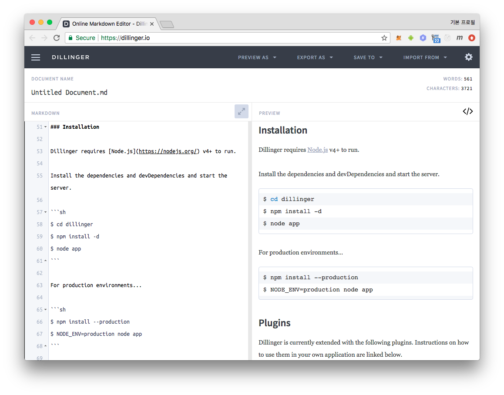
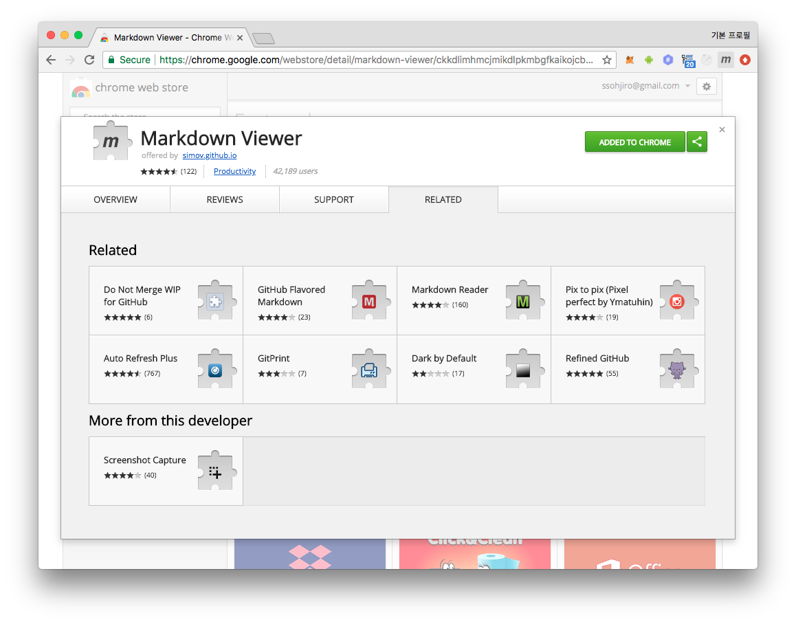

> 마크다운(markdown)은 일반 텍스트 문서의 양식을 편집하는 문법이다. README
파일이나 온라인 문서, 혹은 일반 텍스트 편집기로 문서 양식을 편집할 때 쓰인다.
마크다운을 이용해 작성된 문서는 쉽게 HTML 등 다른 문서형태로 변환이 가능하다.
[출처: wiki-마크다운][wiki]

마크다운은 요즘 SW 개발시 문서 작성, 이슈 게시 등에 가장 많이 쓰이는 문서
포맷이다. 순수 텍스트 기반으로 작성하고 작은 노력으로 적당한 수준의 문서
레이아웃을 생성해주어 글 작성시 콘텐츠에 집중 할 수 있게 도와주며 다른 글 쓰기
방식에 비해 생산성이 좋아 현재는 출판 업계에서도 사용한다.



위의 스크린샷 왼쪽을 보면 사실 마크다운은 `HTML` 처럼 어렵거나 가독성을 많이
떨어뜨리지 않아서 아무 텍스트 에디터로 열어 plain text 로 봐도 무리가 없다.
하지만 스타일이 적용된 HTML 로 렌더해서 보는 것이 훨씬 더 편안하다. 아직
markdown 뷰어가 없어서 제대로 마크다운 문서를 열어보지 못하는 마크다운 입문자
혹은 괜찮은 뷰어를 찾고 있는 분들을 대상 으로 **꽤 괜찮고** 그리고 **OS 종속성
없는** 괜찮은 markdown 뷰어를 소개한다.

## Markdown Viewer / Browser Extension
브라우저를 사용하여 markdown 문서를 HTML 로 보여주는 확장인 **Markdown Viewer**
를 설치해보자.  크롬과 파이어폭스를 지원하지만 크롬 브라우저로 설명한다.

## 1. 설치
크롬 웹 스토어에서 [Markdown Viewer extention][app] 을 설치하자. 설치가 되면
아래 스크린샷 처럼 브라우저 우상단에 `M` 모양 아이콘을 볼 수 있다.


## 2. 로컬 파일 읽기
보안을 위해 브라우저 확장 프로그램이 로컬 파일을 읽기 위해서는 사용자가 직접
허용 해줘야한다. 영상 `0 ~ 27초` 참고 하여 허용해주자:
<iframe width="560" height="315" src="https://www.youtube.com/embed/Wd-wHLm9MTI" frameborder="0" allow="autoplay; encrypted-media" allowfullscreen></iframe>

로컬 파일 접근을 허용 이후에 동영상처럼 `file:///some-directory/` 로 접근해도
되지만 간단하게 `markdown` 파일을 브라우저에 drag & drop 해도 된다.

## 3. TOC 기능
내가 이 viewer 를 사용하는 이유이다. 내용이 긴 단일 markdown 파일을 볼때 헤더
부분을 파싱하여 TOC(Table of Contents) 로 생성하여 보여주고 이 TOC 는 해당
내용에 바로 갈 수 있는 링크 역할도 해준다.

TOC 를 enable 하는 방법은 간단하다.
- 브라우저 우측 상단 `Markdown Viewer` 아이콘 클릭 -> `CONTENTS` -> Turn `TOC` on

영상 `1:44 ~ 1:52` 를 참고해도 좋다.
<iframe width="560" height="315" src="https://www.youtube.com/embed/Wd-wHLm9MTI?start=104" frameborder="0" allow="autoplay; encrypted-media" allowfullscreen></iframe>


## 4. 인터넷의 markdown 문서 바로 읽기
markdown 은 github, gitlab 등 오픈소스 저장소에서 특히 많이 사용되는데
기본적으로 사이트에서 HTML 로 렌더하여 잘 보여주고 있다.

- HTML URL: https://github.com/simov/markdown-viewer/blob/master/README.md

이런 파일을 `RAW` 로 열면 아래 링크처럼 plain text 가 보이는데,
- RAW URL: https://raw.githubusercontent.com/simov/markdown-viewer/master/README.md

이 `RAW` 콘텐츠를 `Markdown Viewer` 를 통해 볼 수 도 있다. 나는 주로 github 에서
기본으로 제공해 주지 않는 TOC 기능을 사용하기 위해 `Markdown Viewer` 를
사용한다.  로컬 파일 접근을 허용 해 준 것 처럼 특정 도메인의 특정 path 별로 허용
해 줄 수 있는데 영상 `0:41 ~ 1:06` 를 참고하여 설정 할 수 있다.

### github
github 의 경우 파일의 `Raw` 버튼을 누르면 , `https://raw.githubusercontent.com`
도메인을 통해 콘텐츠가 제공된다. 위 동영상을 참고하여 이를 `Allowed Origins` 에
추가하고 `MATCH` 란에는 기본값 또는 정규식 `\.md$` 를 입력해주자.

### gitlab
gitlab 의 경우 `Open Raw` 버튼을 누르면 같은 `gitlab.com` 도메인 아래
`/<namespace>/<proejctName>/raw/<ref>/<filepath>` 패턴의 주소로 열린다.
`Allowed Origins` 에 `https://gitlab.com` 을 추가하고 `MATCH` 란에는
아래 정규식을 추가하자.

```js
\/.+?\/.+?\/raw\/.*\/.*\.md$
```

> 설정 변경 후 새로고침 하면 흰화면이 보이는 버그가 있다. 브라우저를
> 재시작하거나 새로고침 으로 해결되었다.

블로그의 내용은 [공식 가이드][official] 에도 잘 설명되어 있다.

## 발언
익숙하다는 이유로 딱히 해당 프로그램의 기능이 필요한 문서가 아닐 때도 마크다운
대신 엑셀, 워드, 파워포인트 등을 사용해 문서를 만드는 것은 많은 경우에서 **크게
잘못된 결정**이다. 무겁고 버전관리도 힘들고 OS 종속성도 있다. 그러지 말자.
제발 그러지 말자.

의외로 마크다운을 작성하지 못하는 개발자들이 많다. 마크다운 지원 채팅방이나 댓글
입력시 의도치 않게 레이아웃이 깨져 가독성이 떨어지고 읽는 사람이 불편 할 수
있다. 마크다운이 개발자가 익혀야할 기본소양은 아니지만 학습능력은 개발자의 기본
덕목이며 마크다운은 5분만 투자하면 거의 **마스터** 할 수 있을 만큼 쉽다.  5분
정도 투자해서 배울 수 있는 것들 중 업무 생산성에 이 만큼 도움을 줄 수 있는 것도
없는 듯 하다.

- 학습 및 연습 하기 좋은 사이트. 배우러 가즈아!!
    - https://guides.github.com/features/mastering-markdown/
    - https://jbt.github.io/markdown-editor/
    - https://dillinger.io/


[wiki]: https://ko.wikipedia.org/wiki/마크다운
[app]: https://chrome.google.com/webstore/detail/markdown-viewer/ckkdlimhmcjmikdlpkmbgfkaikojcbjk?utm_source=chrome-ntp-icon
[official]: https://github.com/simov/markdown-viewer
[official_youtube]: https://www.youtube.com/watch?v=Wd-wHLm9MTI
