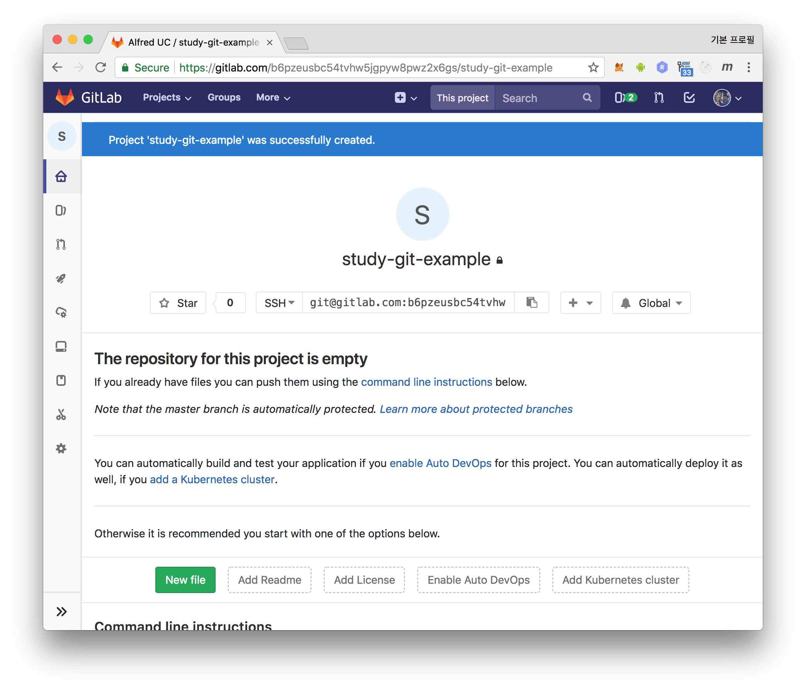

내가 생각하는 분산 버전 컨트롤 시스템인 git 의 최대 장점은 **서버 없이 언제라도 즉시**
try 해 볼 수 있다는 것이다.

```sh
$ git init
```

현재 디렉토리에 `.git` 이라는 디렉토리가 생기고 여기에서 git 과 관련된 모든
데이터와 상태가 관리된다. 로컬 파일 시스템에 git 저장소가 생긴 것인데 디렉토리
안에 파일을 버전 관리 할 수 있게 git 으로 첫번째 커밋을 해보자:
```sh
$ npm init
$ git status
$ git add .
$ git status
$ git add package.json
$ git commit -m "first commit"
$ git status
$ git log
```

중간에 `git status` 명령어를 통해 현재 상태를 계속해서 확인하고 있다. git 을
공부하는 차원에서 `status` 명령어를 실행 하기 전에 머리속으로 현재 상태를
예측해보고 예측한 결과가 맞는지 확인 해가면서 연습하면 좋다. 앞으로 글에서는
`git status` 를 명시적으로 하진 않겠지만 익숙해 질 때 까지 `git status` 를
확인하는 습관을 들이자. 타이핑이 힘들면 다음 alias 설정을 통해 `git st` 로
줄여서 할 수 있다.

```sh
$ git config --global alias.co checkout
$ git config --global alias.br branch
$ git config --global alias.ci commit
$ git config --global alias.st status
```

커밋을 2개 더 해보자.

```sh
$ vi userList.js
$ vi print.js
$ git add userList.js
$ git commit -m "add userList"
$ git add print.js
$ git commit
$ git status
$ git log
```

# branch

```sh
$ git branch
* master
```

`git init` 명령시 기본으로 `master` 브랜치가 생성된다.
`master` 라는 이름의 브랜치라고 해서 특별한 동작을 하는 것은 아니고 단순 git 의
기본 동작에 의해 `master` 라는 이름으로 지어지는 것 뿐이다. 보통 현업에서
`master` 브랜치를 `stable` 한 코드를 관리하는 메인 브랜치로 사용한다.

따라서 개발을 할 때 `master` 브랜치에서 작업 하는 것이 아니라 별도의 브랜치를
만들고 그 브랜치에서 개발을 한 뒤 커밋을 하고 테스트를 수행하고 `stable` 하다고
판단되었을때 `master` 브랜치로 merge 하는 방식으로 개발이 진행된다. 규모가 큰
프로젝트에서는 `master` 브랜치 이전의 중간 통합 브랜치가 있을 수 있고 팀의
브랜치 전략에 따라 얼마든지 다른 방법으로 사용 될 수 있으나 여기에서는 개발
브랜치가 바로 master 브랜치에 merge 되는 전략으로 설명한다. user 를 선택하는
기능을 개발할 `pick` 이라는 이름의 브랜치를 만들고 현재 브랜치를 switch 해보자.

```sh
$ git branch           # 현재 브랜치 리스트
* master

$ git branch pick      # pick 브랜치 생성
$ git branch           # 브랜치 리스트 확인
* master
  pick

$ git checkout pick    # pick 브랜치로 checkout
$ git branch           # HEAD 의 위치 확인
  master
* pick
```

`git branch` 명령으로 하나의 브랜치 이름앞에 `*` 가 붙은 것을 확인 할 수 있는데
현재 브랜치를 표시 한다고 말 할 수도 있고 좀 더 정확히 얘기 하면, `HEAD` 가
어디를 가르키고 있는지 나타내는 것이다. 그렇다면 `HEAD` 란 무엇일까?  LP 판이나
비디오 테이프 혹은 [카세트 테이프][cassette] 에서 볼 수 있는 HEAD 라고 생각하자.

HEAD 가 닿아야 카세트 테이프의 담긴 노래 소리도 나오고 녹음도 할 수 있다. 커밋
하나를 노래 한소절을 녹음하는 것에 비유하면 녹음이 되는 위치는 현재 HEAD 가 있는
곳 다음일 것이다.


P4 나 SVN 에서 브랜치를 만들면 별도의 디렉토리에 현재 형상을 한벌 복사하여
관리하게 된다. 파일 시스템에 특정 시점에 두벌 이상의 형상이 동시에 존재 하게
되는 것인데 100메가 짜리 형상이라면 추가로 100메가의 저장 용량이 더 필요한
꽤 무겁고 번거로운 작업이다. git 은 다르다. 특정
순간 파일들의 형상인 스냅샷, 즉 커밋 기반으로 동작하는데, 브랜치는 단순히 어떤
스냅샷을 가르킬지 커밋의 SHA-1 리비전 참조(`reference`) 정보를 가지고 있는 40
Byte 짜리 파일 하나라고 볼 수 있다. 따라서 브랜치를 만드는 것이 1초도 걸리지
않고 저장 용량도 40 Byte 밖에 늘어나지 않는다.

브랜치와 커밋의 관계를 설명하기 위해 아래 log 명령을 실행해보자:
```
$ git log --graph --oneline --all
* c3 (HEAD -> pick, master) add print.js
* c2 add userList
* c1 first commit
```

위의 결과를 설명하자면 `c1` `c2` `c3` 3개의 스냅샷이 있고,
`master`, `pick` 두개의 브랜치 모두 `c3` 스냅샷을 가르키고 있고 `HEAD` 는
`pick` 브랜치를 가르키고 있다. 즉 HEAD 의 위치는 `c3` 인것이다.  이제
`pick` 브랜치에서 개발을 해 본 후 커밋을 해보자:
```
$ git add .
$ git commit -m "add pick.js, add one user"
```

2개의 브랜치의 커밋 정보를 동시에 보기위해 아래 명령어를 사용하자:
```sh
$ git log --graph --oneline --all
* c4 (HEAD -> pick) add pick.js, add one user
* c3 (master) add print.js
* c2 add userList
* c1 first commit
```

# merge
pick 브랜치에서 작업한 내용이 테스트가 완료되어 master 브랜치에 머지해야 한다고
가정하자.

## fast-forward merge
먼저 master 브랜치로 switch 한 뒤 pick 브랜치를 머지해보자:

```sh
$ git checkout master
$ git log --graph --oneline --all
* c4 (pick) add pick.js, add one user
* c3 (HEAD -> master) add print.js
* c2 add userList
* c1 first commit

$ git merge pick
Updating c3..c4
Fast-forward
 pick.js     | 4 ++++
 userList.js | 2 +-
 2 files changed, 5 insertions(+), 1 deletion(-)
 create mode 100644 pick.js

$ git log --graph --oneline --all
* c4 (HEAD -> master, pick) add pick.js, add one user
* c3 add print.js
* c2 add userList
* c1 first commit
```

git 에서의 merge 는 `3-way` 방식과 `Fast-forward` 방식 두가지가 있다. 위의
output 을 보면 `Fast-forward` 방식으로 머지가 되었다는 것을 확인 할 수 있다.
커밋(스냅샷)은 hash tree 구조로 되어있어 부모커밋으로 이전커밋의 정보를 가지게
된다.  `Fast-forward` 는 `빨리 감기` 인데 즉 `c3` HEAD 를 `c4` 위치로
이동시켜 빨리 감기를 한 것이다. `Fast-forward` 는 자식 커밋 방향으로만 가능하다.

## 3-way merge
그럼 이제 `Fast-forward` 가 불가능한 상황을 만들어서 `3-way` 머지를 해보자.
HEAD 를 `pick` 브랜치로 옮긴 후 커밋을 1개 이상 한 뒤, HEAD 를 다시 master 브랜치
로 옮기고 커밋을 1개 이상 하자:

```sh
$ git checkout pick
$ git commit
$ git checkout master
$ git commit
$ git --graph log --oneline --all
➜  ttt git:(master) git log --graph --oneline --all
* c6 (HEAD -> master) add user
| * c5 (pick) change log
|/
* c4 add pick.js, add one user
* c3 add print.js
* c2 add userList
* c1 first commit
```

흔히 내가 작업을 하던 사이 다른 작업자가 커밋을 했을때 흔히 발생하는 상황이다.
`c6` 의 자식 방향으로만 `Fast-forward` 머지가 가능한데 머지해야할 `c5`
커밋은 자식 커밋이 아닌 공통 부모커밋을 가지고 있는 커밋이다. output 의 그래프
모양만 봐도 자식커밋이 아니란 것을 한번에 알 수 있고 이경우 현재 `c6`
위치의 `HEAD` 가 `c5` 커밋이 있는 위치로 빨리감기 할 수 없는 상황이다.
머지해보자:

```sh
$ git merge pick
Merge made by the 'recursive' strategy.
 pick.js | 2 +-
 1 file changed, 1 insertion(+), 1 deletion(-)

$ git log --graph --oneline --all
*   m1 (HEAD -> master) Merge branch 'pick'
|\
| * c5 (pick) change log
* | c6 add user
|/
* c4 add pick.js, add one user
* c3 add print.js
* c2 add userList
* c1 first commit
```

커밋메시지를 입력하라고 에디터가 열리면 기본 입력된 내용을 그냥 저장하고 닫자.
`c6` 과 `c5` 을 이어주는 `m1` 커밋이 생겼고, 이 커밋을 머지 커밋
이라고 부른다. 위 케이스는 다행히 `충돌` 이 나지 않는 케이스이다. 아래 동영상을
보며 3-way 방식의 머지가 어떻게 충돌을 판단하는지 도움이 된다.

<iframe width="1247" height="701" src="https://www.youtube.com/embed/J0W-WA0aYJI" frameborder="0" allow="autoplay; encrypted-media" allowfullscreen></iframe>

## conflict
위의 동영상에 나온 케이스를 재현해서 머지시 발생하는 충돌을 처리를 해보자.
아래 파일을 추가하고 커밋하자.

`some.info`
```js
{
  AAA
}
{
  BBB
}
{
  CCC
}
{
  DDD
}
```

```
$ git add some.info
$ git commit -m "add some.info"
```

동영상에 나오는 `Base` 부분이 준비된 것이다. `Me`, `Other` 브랜치를
생성하고 동영상 내용과 일치하게 파일을 수정해 볼 것이다.

```sh
$ git log --graph --oneline --all
* c7 (HEAD -> master) add some.info
*   m1 Merge branch 'pick'
|\
| * c5 (pick) change log
* | c6 add user
|/
* c4 add pick.js, add one user
* c3 add print.js
* c2 add userList
* c1 first commit
$ git branch me
$ git branch other
$ git checkout me
$ vi some.info
```

`git branch` 이후의 첫번째 인자는 생성될 브랜치의 이름이고 두번째 인자는
생성되는 브랜치가 가르킬 커밋의 정보인데, 생략하면 `HEAD` 가 사용되므로 me,
other 브랜치 모두 `c7` 커밋을 가르킨다.

me 브랜치에서는 `some.info` 를 아래와 같이 수정하고 커밋하자.
```js
{
  AAA
}
{
  BBB
}
{
  111
}
{
}
```

```sh
$ git add some.info
$ git commit -m "change of me"
```

other 브랜치에서도 아래 내용으로 커밋을 진행하자.
```js
{
}
{
  BBB
}
{
  222
}
{
  DDD
}
```

```
$ git checkout other
$ vi some.info
$ git add .
$ git commit -m "change of other"
```

자 이제 HEAD 를 me 브랜치로 옮긴 후 other 의 변경을 merge 해보자.

```
$ git checkout me
$ git merge other
Auto-merging some.info
CONFLICT (content): Merge conflict in some.info
Automatic merge failed; fix conflicts and then commit the result.

$ git status
On branch me
You have unmerged paths.
  (fix conflicts and run "git commit")
  (use "git merge --abort" to abort the merge)

Unmerged paths:
  (use "git add <file>..." to mark resolution)

	both modified:   some.info

no changes added to commit (use "git add" and/or "git commit -a")
```

`CONFLICT` 이 발생했고 어떤 파일에서 충돌이 발생해 아직 unmerged 상태인지,
충돌을 해결하려면 어떻게 해야하는지, merge 를 취소하려면 어떻게 해야하는지 모든
가이드가 `git status` 명령의 output 으로 친절하게 표시된다. output 내용을
참고하여 충돌을 해결하고 머지를 완료해보자. 먼저 `some.info` 파일을 살펴보자.

```sh
$ cat some.info 
{
}
{
  BBB
}
{
<<<<<<< HEAD
  111
=======
  222
>>>>>>> other
}
{
}
```

3-way 머지에서 충돌이 나면 위와같이 `<<<<<<< HEAD` 과 `=======` 그리고 `>>>>>>>
other` 를 delimeter 로 해서 이 사이에 각 브랜치에서의 충돌된 부분이 표시되고
충돌을 해결하는 것은 단순 저 파일을 원하는 형태로 수정 하는 것 뿐이다. delimeter
는 단순 충돌이 난 부분 표시를 위해서이지 delimeter 밖의 부분도 필요시 얼마든 지
수정 할 수 있다. 예 에서는 내가 변경한 `111` 이 맞을 수도 있고, 아니면 `111` 도
아니고 `222` 도 아닌 제 3의 다른 값이 맞을 수도 있다. `MMM` 이 될 수도 있다.
제 3의 값인 `MMM` 으로 수정하고 delimeter 도 제거하자:

`some.info`
```js
{
}
{
  BBB
}
{
  MMM
}
{
}
```

저장한 뒤 빠져나오자. output 에 나온 가이드를 참고하여 충돌 해결된 것을 마킹하자:
```
$ git add some.info
$ git status
On branch me
All conflicts fixed but you are still merging.
  (use "git commit" to conclude merge)

Changes to be committed:

	modified:   some.info
```

다시한번 output 에 나오는 가이드에 따라 `git commit` 명령어로 머지를 완료 할 수
있다. 이때 커밋 메시지를 남기기 위해 에디터가 열리는데 지금은 기본으로 쓰여있는
메시지를 사용해도 무방하다. 머지를 완료하고 로그를 확인해보자.

```
$ git commit
[me f9d7bb8] Merge branch 'other' into me

$ git log --graph --oneline --all
*   f9d7bb8 (HEAD -> me) Merge branch 'other' into me
|\
| * c92baa4 (other) change of other
* | d7e1e26 change of me
|/
* e920158 (master) add some.info
*   8928723 Merge branch 'pick'
|\
| * 5f6754b (pick) change log
* | 4373443 add user
|/
* dadbe71 add pick.js, add one user
* d1bb054 add print.js
* 2533112 add userList
* 0760b3f first commit
```

# remote repository
로컬에서의 작업을 다른 작업자와 공유하려면 원격 저장소를 사용해야한다. `git init
--bare` 옵션을 붙여서 파일 시스템에 원격 저장소 역할을 하는 디렉토리를 만들어서
연습 하는 것도 어렵지 않지만, 이렇게 하면 실제 다른 작업자가 접속하기가 어려우니
github, gitlab 등의 git 원격 저장소 호스팅 서비스를 사용해서 진행하자. 요즘은
기업에서도 github enterprise, gitlab-ee 등을 많이 사용하는 추세다.

gitlab 은 개인 프로젝트를 무료로 private 저장소로 생성 할 수 있어서 연습하기
좋다. github 와 gitlab 은 기본적인 사용법이 매우 유사하여 둘중 하나만 익숙해져도
다른 하나는 진입장벽 없이 바로 적응 할 수 있을 정도이다. 여기에서는 gitlab
기준으로 설명한다.

브라우저로 https://gitlab.com 에 방문 해서 가입 후 로긴을 한 뒤 새 프로젝트를
생성하자. (버튼을 못 찾겠으면 [프로젝트 생성 페이지 주소][newproject]를
사용하자) `Project name` 을 정하고 `Create project` 로 프로젝트를 생성하면
아래와 같은 화면을 볼 수 있다.



# git push
gitlab 원격 저장소의 주소는 `https`, `ssh` 두가지 프로토콜로 제공되는데 둘의
차이 중 하나는 인증방법이다. `https` 를 사용하게되면 매번 gitlab id, password 를
물어 보는 귀찮음이 따를 수 있다. `ssh` 는 비대칭키를 사용하여 인증하는데 gitlab
쪽에 공개키를 등록해 두고 비밀키를 통해 통신한다. [여기][registerssh]에서
공개키를 등록 할 수 있다. 등록 페이지에 가이드 링크도 있으니 참고해서 등록한 후
`ssh` 주소를 사용해서 진행하는 것을 권한다.

로컬 저장소에서 원격 저장소를 추가한뒤 잘 추가 되었는지 확인해보자:
```sh
$ git remote add origin git@gitlab.com:b6pzeusbc54tvhw5jgpyw8pwz2x6gs/study-git-example.git
$ git remote -v
origin	git@gitlab.com:b6pzeusbc54tvhw5jgpyw8pwz2x6gs/study-git-example.git (fetch)
origin	git@gitlab.com:b6pzeusbc54tvhw5jgpyw8pwz2x6gs/study-git-example.git (push)
```

`origin` 이라는 원격 저장소 이름으로 원격 저장소를 추가 한 것이고 `origin`
이라는 이름 또한 git 에서 많이 쓰이는 원격 저장소 이름 일 뿐 특별한 동작을
하거나 예약어가 아니다. 다른 이름으로 지어도 무방하며 흔히 `origin` 이라고 하면
거의 원격 저장소라 이해하면 된다. 로컬의 커밋들을 원격저장소로 밀어넣는 것을
`push` 라고 한다. push 는 브랜치 단위(또는 `tag` 단위) 로 진행된다.  브랜치를
push 하기위해 `master` 브랜치로 이동 한 후 `push` 명령어를 실행하자:
```sh
$ git checkout master
$ git push
fatal: The current branch master has no upstream branch.
To push the current branch and set the remote as upstream, use

    git push --set-upstream origin master
```

git 에서의 브랜치는 **local branch** 와 **upstream branch**(또는 **remote
tracking branch**) 로 구분된다. **local branch** 는 지금까지 다뤘던 master, pick
브랜치와 같이 작업을 하고 커밋을 할 수 있는 브랜치이며 `git branch` 명령어로
확인 할 수 있다.

**upstream branch** 는 원격 저장소와의 싱크를 위해 로컬 저장소 내부에서 관리하고
있는 브랜치이다. 브랜치의 이름은 `remotes/<원격저장소이름>/<브랜치이름>` 이며
`git branch` 명령어에 `--all` 옵션을 사용해야 확인 할 수 있다. 항상 `원격
저장소의 branch` 에서 `로컬에 있는 upstream branch` 방향으로 단방향 싱크가 된다.

```sh
$ git push <원격저장소이름> <브랜치이름>
```

이 명령어는 HEAD 가 위치한 브랜치의 커밋들을 `<원격저장소이름>` 의
`<브랜치이름>` 으로 push 하는 명령어이다. 뒤의 인자 두개를 생략하면 현재
브랜치에 셋팅 되어있는 upstream branch 가 가르키는 원격저장소의 브랜치로 push
하게되는데 아직 현재브랜치에 upstream branch 가 셋팅되어있지 않아서 에러가 발생
한 것이다. 에러 메시지의 가이드대로 `--set-upstream` 옵션을 추가하면 `origin`
원격 저장소의 `matser` 브랜치를 tracking 하는 upstream 브랜치를 만들고 local
`master` branch 의 upstream 브랜치로 set 한 뒤 `push` 를 한다. push 한뒤
upstream 브랜치를 확인해보자:
```sh
$ git push --set-upstream origin master
Counting objects: 24, done.
Delta compression using up to 8 threads.
Compressing objects: 100% (20/20), done.
Writing objects: 100% (24/24), 2.33 KiB | 1.17 MiB/s, done.
Total 24 (delta 9), reused 0 (delta 0)
To gitlab.com:b6pzeusbc54tvhw5jgpyw8pwz2x6gs/study-git-example.git
 * [new branch]      master -> master
Branch 'master' set up to track remote branch 'master' from 'origin'.

$ git branch --all
* master
  me
  other
  pick
  remotes/origin/master
```

`--all` 옵션을 붙이면 `remotes/origin/master` 라는 upstream 브랜치를 확인 할 수
있고, 아래 명령어로 local `master` branch 에 set 된 upstream branch 설정을 확인 할
수 있다.

```sh
$ git config branch.master.remote
origin
$ git config branch.master.merge
refs/heads/master
```

이후에는 `git push` 명령어 뒤 인자를 생략하여 `origin` 원격 저장소의 `master`
브랜치로 push 할 수 있다.

# clone
원격저장소를 처음 로컬로 내려 받을 때 `clone` 명령어를 사용한다.  git 은
분산형상관리 시스템이기 때문에 svn 처럼 특정 리비전을 checkout 받는 다는
표현보단 모든 브랜치, 모든 커밋을 포함한 저장소의 사본을 통째로 내려받는 것이기
때문에 `clone` 명령어가 어울린다.

다른 pc 에서 작업해도 좋으나 번거로우니 새로운 디렉토리로 이동 한 후 clone 을
받아보자. 즉 우리의 실습 브랜치는 아래와 같이 될 것 이다.

```
.
├── git-study-example
├── user1
├── user2
└── user3
```

이 저장소를 4명이 공유하며 작업한다고 가정하고 clone 을 총 3번 해보자:
```
$ git clone git@gitlab.com:b6pzeusbc54tvhw5jgpyw8pwz2x6gs/study-git-example.git user1
$ git clone git@gitlab.com:b6pzeusbc54tvhw5jgpyw8pwz2x6gs/study-git-example.git user2
$ git clone git@gitlab.com:b6pzeusbc54tvhw5jgpyw8pwz2x6gs/study-git-example.git user3
```

clone 명령어의 2번째 인자는 directory 이름이다. user1 디렉토리로 들어가 확인해보자.
```
$ cd user1
$ git log --graph --oneline --all
* e920158 (HEAD -> master, origin/master, origin/HEAD) add some.info
*   8928723 Merge branch 'pick'
|\
| * 5f6754b change log
* | 4373443 add user
|/
* dadbe71 add pick.js, add one user
* d1bb054 add print.js
* 2533112 add userList
* 0760b3f first commit

$ git branch --all
* master
  remotes/origin/HEAD -> origin/master
  remotes/origin/master
```

push 할때의 HEAD 가 위치한 브랜치였던 master 브랜치만 보이는 것을 확인 할 수
있다.  clone 시 원격 저장소의 모든 브랜치들을 받아오게 되는데 로컬에는 하나의
원격 브랜치마다 하나의 upstream 가 생성된다. upstream 브랜치는 작업 할 수 없는
브랜치이기 때문에 원격 저장소의 HEAD 위치의 브랜치를 로컬 브랜치로 생성 후
로컬 저장소의 HEAD 를 여기에 위치시켜 주어 작업 가능한 상태까지 만들어 준다.

gitlab, github UI 에서 default 브랜치를 설정하여 원격 브랜치의 HEAD 가 가르키는
브랜치를 변경 할 수 있고 여기서는 local master 브랜치가 생성되었고 HEAD attach
된 것을 확인 할 수 있다.

# commit graph 더렵혀보기
git 을 아무런 브랜치 전략 없이 사용하게 되었을때 되면 발생할 수 있는 일을
재현해보자.

## 여러 작업자가 자신의 로컬 저장소에 커밋
`user1` 디렉토리에서
```
$ git config user.name "user1"
$ git config user.email "user1@example"
$ touch user1.info
$ git add user1.info
$ git commit -m "add user1.info"
```

`user2` 디렉토리에서
```
$ git config user.name "user2"
$ git config user.email "user2@example"
$ touch user2.info
$ git add user2.info
$ git commit -m "add user2.info"
```

`user3` 디렉토리에서
```
$ git config user.name "user3"
$ git config user.email "user3@example"
$ touch user3.info
$ git add user3.info
$ git commit -m "add user3.info"
```

user1, user2, user3 3명의 개발자가 각각 자신의 로컬 저장소에서 master
브랜치에 커밋 하나씩을 추가한 케이스이다. 이 3개의 커밋들은 모두 `e920158`
커밋을 공통 부모로 가진다.

## user1 push 시도
user1 디렉토리에서 새로운 커밋을 push 해보자.

```
$ git push
Counting objects: 3, done.
Delta compression using up to 8 threads.
Compressing objects: 100% (2/2), done.
Writing objects: 100% (3/3), 264 bytes | 264.00 KiB/s, done.
Total 3 (delta 1), reused 0 (delta 0)
To gitlab.com:b6pzeusbc54tvhw5jgpyw8pwz2x6gs/study-git-example.git
   e920158..8a65182  master -> master
```

아래 명령어로 upstream 브랜치로부터 local 브랜치를 생성 할 수 있는데,
```
$ git checkout -b <branch> --track <remote>/<branch>
```
이렇게 생성된 local 브랜치는 `--track` 옵션으로 넘겨준 remote traking 브랜치를
자신의 upstream 브랜치로 갖게된다. clone 시 자동으로 생성된 local master
브랜치도 내부적으로 이 명령어를 통해 생성되었다고 볼 수 있는데, 이러한 이유로
`--set-upstream` 옵션 없이 바로 push 가 가능했던 것이다.

## user2 push 시도
user2 디렉토리로 이동하여 push 시도해보자.

```
$ git push
To gitlab.com:b6pzeusbc54tvhw5jgpyw8pwz2x6gs/study-git-example.git
 ! [rejected]        master -> master (non-fast-forward)
error: failed to push some refs to 'git@gitlab.com:b6pzeusbc54tvhw5jgpyw8pwz2x6gs/study-git-example.git'
hint: Updates were rejected because the tip of your current branch is behind
hint: its remote counterpart. Integrate the remote changes (e.g.
hint: 'git pull ...') before pushing again.
hint: See the 'Note about fast-forwards' in 'git push --help' for details.
```

에러가 났다. ~~이러고 그냥 퇴근하면 주말에 출근을 할 수도 있으니~~ 꼭 output 을
잘 확인해야한다. 많은 개발자가 여기서 하는 행동은 `git pull` 이다. 진행해보자.

```sh
$ git pull
Merge made by the 'recursive' strategy.
 user1.info | 0
 1 file changed, 0 insertions(+), 0 deletions(-)
 create mode 100644 user1.info

$ git log --graph --oneline --all
*   f6e1087 (HEAD -> master) Merge branch 'master' of gitlab.com:b6pzeusbc54tvhw5jgpyw8pwz2x6gs/study-git-example
|\
| * 8a65182 (origin/master, origin/HEAD) add user1.info
* | 3e4b449 add user2.info
|/
* e920158 add some.info
```

충돌이 나지 않는다면 커밋 메시지를 입력하라는 텍스트 에디터가 열리며 메시지를
입력하면 머지 커밋이 자동으로 생성되고 위와 같은 커밋 그래프를 볼 수 있다.
지금까진 나쁘지 않다. 다시 push 해보자:
```
$ git push
Counting objects: 4, done.
Delta compression using up to 8 threads.
Compressing objects: 100% (4/4), done.
Writing objects: 100% (4/4), 489 bytes | 489.00 KiB/s, done.
Total 4 (delta 2), reused 0 (delta 0)
To gitlab.com:b6pzeusbc54tvhw5jgpyw8pwz2x6gs/study-git-example.git
   8a65182..f6e1087  master -> master
```

에러 없이 성공했다. user3 디렉토리로 이동하여 반복해보자.

## user3 push
```
$ git push
To gitlab.com:b6pzeusbc54tvhw5jgpyw8pwz2x6gs/study-git-example.git
 ! [rejected]        master -> master (fetch first)
error: failed to push some refs to 'git@gitlab.com:b6pzeusbc54tvhw5jgpyw8pwz2x6gs/study-git-example.git'
hint: Updates were rejected because the remote contains work that you do
hint: not have locally. This is usually caused by another repository pushing
hint: to the same ref. You may want to first integrate the remote changes
hint: (e.g., 'git pull ...') before pushing again.
hint: See the 'Note about fast-forwards' in 'git push --help' for details.

$ git pull
remote: Counting objects: 4, done.
remote: Compressing objects: 100% (4/4), done.
remote: Total 4 (delta 2), reused 0 (delta 0)
Unpacking objects: 100% (4/4), done.
From gitlab.com:b6pzeusbc54tvhw5jgpyw8pwz2x6gs/study-git-example
   8a65182..f6e1087  master     -> origin/master
Merge made by the 'recursive' strategy.
 user1.info | 0
 user2.info  | 0
 2 files changed, 0 insertions(+), 0 deletions(-)
 create mode 100644 user1.info
 create mode 100644 user2.info

$ git push
Counting objects: 4, done.
Delta compression using up to 8 threads.
Compressing objects: 100% (4/4), done.
Writing objects: 100% (4/4), 533 bytes | 533.00 KiB/s, done.
Total 4 (delta 2), reused 0 (delta 0)
To gitlab.com:b6pzeusbc54tvhw5jgpyw8pwz2x6gs/study-git-example.git
   f6e1087..5efb1bb  master -> master

$ git log --graph --oneline --all
*   5efb1bb (HEAD -> master, origin/master, origin/HEAD) Merge branch 'master' of gitlab.com:b6pzeusbc54tvhw5jgpyw8pwz2x6gs/study-git-example
|\
| *   f6e1087 Merge branch 'master' of gitlab.com:b6pzeusbc54tvhw5jgpyw8pwz2x6gs/study-git-example
| |\
| | * 8a65182 add user1.info
| * | 3e4b449 add user2.info
| |/
* | b23b1d7 add user3.info
|/
* e920158 add some.info
```

commit graph 가 복잡해졌다. 사실 이정도는 용납할만 하다. 다만 실제업무에서
3,4명의 개발자가 모두 이런 방식으로 git 을 사용하게 된다면 아래와 같은 그래프가
되는 것은 시간문제다.


# rebase
merge 하기전 rebase 를 하면 위의 복잡한 그래프 모양을 방지 할 수 있다.  먼저
다시한번 user1, user2, user3 디렉토리에 가서 원격 최신 형상으로 pull 을 받은 뒤
커밋 하나씩을 해보자.

user1 에서:
```sh
$ git pull
# user1.info 파일 수정
$ git add user1.info
$ git commit -m "change user1.info"
```

user2 에서:
```sh
$ git pull
# user2.info 파일 수정
$ git add user2.info
$ git commit -m "change user2.info"
```
user3 에서:
```sh
$ git pull
# user3.info 파일 수정
$ git add user3.info
$ git commit -m "change user3.info"
```

## user1 push

user1 디렉토리에서 새로운 커밋을 push 해보자:
```sh
$ git push
Counting objects: 3, done.
Delta compression using up to 8 threads.
Compressing objects: 100% (2/2), done.
Writing objects: 100% (3/3), 287 bytes | 287.00 KiB/s, done.
Total 3 (delta 1), reused 0 (delta 0)
To gitlab.com:b6pzeusbc54tvhw5jgpyw8pwz2x6gs/study-git-example.git
   5efb1bb..f8e0abd  master -> master
```

pull 이후 push 하기전 그 사이에 다른 커밋이 push 되지 않은 상태이므로 에러없이
잘 된다.

## user2 fetch, rebase, push

user2 가 pull 받고 새로운 커밋을 로컬에 추가하고 push 하는 그 사이
user1 의 새로운 커밋이 push 되었기 때문에 user2 의 커밋은 실패한다.
```sh
$ git push
To gitlab.com:b6pzeusbc54tvhw5jgpyw8pwz2x6gs/study-git-example.git
 ! [rejected]        master -> master (fetch first)
error: failed to push some refs to 'git@gitlab.com:b6pzeusbc54tvhw5jgpyw8pwz2x6gs/study-git-example.git'
hint: Updates were rejected because the remote contains work that you do
hint: not have locally. This is usually caused by another repository pushing
hint: to the same ref. You may want to first integrate the remote changes
hint: (e.g., 'git pull ...') before pushing again.
hint: See the 'Note about fast-forwards' in 'git push --help' for details.
```

아까는 `git pull` 로 해결했었다. 이 명령어는 `git fetch && git merge` 명령어의
줄임이라고 볼 수 있는데, 뒤에 오는 `git merge` 명령어에 의해서 mereg 가 된
것이었다. `fetch` 명령어는 무엇일까? fetch 는 원격 저장소의 브랜치에서 로컬의
upstream 브랜치 방향으로 싱크 시키는 명령어이다. `pull` 명령어를 사용하지 않고
`fetch` 명령어만 사용 한 후 상태를 확인해보자.

```sh
$ git log --graph --oneline --all
* 9709e41 (HEAD -> master) change user2.info
*   5efb1bb (origin/master, origin/HEAD) Merge branch 'master' of gitlab.com:b6pzeusbc54tvhw5jgpyw8pwz2x6gs/study-git-example
|\
| *   f6e1087 Merge branch 'master' of gitlab.com:b6pzeusbc54tvhw5jgpyw8pwz2x6gs/study-git-example
| |\
| | * 8a65182 add user1.info
| * | 3e4b449 add user2.info
| |/
* | b23b1d7 add user3.info
|/
* e920158 add some.info

$ git fetch
remote: Counting objects: 3, done.
remote: Compressing objects: 100% (2/2), done.
remote: Total 3 (delta 1), reused 0 (delta 0)
Unpacking objects: 100% (3/3), done.
From gitlab.com:b6pzeusbc54tvhw5jgpyw8pwz2x6gs/study-git-example
   5efb1bb..f8e0abd  master     -> origin/master

$ git log --graph --oneline --all
* 9709e41 (HEAD -> master) change user2.info
| * f8e0abd (origin/master, origin/HEAD) change user1.info
|/
*   5efb1bb Merge branch 'master' of gitlab.com:b6pzeusbc54tvhw5jgpyw8pwz2x6gs/study-git-example
|\
| *   f6e1087 Merge branch 'master' of gitlab.com:b6pzeusbc54tvhw5jgpyw8pwz2x6gs/study-git-example
| |\
| | * 8a65182 add user1.info
| * | 3e4b449 add user2.info
| |/
* | b23b1d7 add user3.info
|/
* e920158 add some.info
```

`origin/master` 브랜치의 변경을 확인 할 수 있다. 아까 `pull` 명령어에서는
이상태에서 `git merge` 명령어를 실행한 것이었다. 우리는 여기서 `git rebase`
명령어를 실행 할 것인데 그 전에 먼저 `rebase` 에 대해 알아보자.

```sh
$ git rebase <SHA>
```

가장 간단한 rebase 명령어이다. 첫번째 인자로 새로운 base 가 될 커밋의 SHA 또는
커밋을 가르키는 참조(branch, tag)를 넘기면 현재 HEAD 의 base 를 해당 `<SHA>`
위치로 다시 잡고, 현재 base 부터 HEAD 까지의 커밋을 하나씩 추가한다.

man 페이지의 예시를 참고해보자:
```sh
      A---B---C topic
     /
D---E---F---G master
```

topic 브랜치에서 `git rebase master` 명령을 하게되면 아래와 같이 변경된다.
```sh
              A'--B'--C' topic
             /
D---E---F---G master
```

topic 브랜치는 `E` 커밋에서 분기되었는데 즉 `E` 커밋이 topic 브랜치의 base
였다고 말할 수 있다. `git rebase master` 명령어는 이 topic 브랜치의 base 를
master 브랜치가 가르키고 있는 `G` 커밋으로 다시 잡는 명령어이다. 참고로 `git
rebase G` 도 가능하며 동일한 효과이다.

A 의 부모가 E 에서 G 로 변경이 되어 `A` 커밋은 `A'` 커밋이 되었고, B, C 또한
연쇄적으로 부모가 변경되어 `B'` `C'` 로 변경되었다. 커밋 내용의 변경 여부에 상관
없이 SHA 가 변경되었다는 것인데 매우 중요한 부분이고 뒤에 이어서 설명하겠다.

자 그럼 `rebase` 를 실습해보자. 위의 man 페이지 예제는 topic 브랜치를 master
브랜치가 가르키는 커밋으로 rebase 한 것이었고, 우리의 예제에서는 master 브랜치를
origin/master 브랜치가 가르키는 커밋으로 rebase 해야하는 상황이다.

```sh
$ git rebase origin/master
First, rewinding head to replay your work on top of it...
Applying: change user2.info
```

위 rebase 명령어의 첫번째 인자인 `origin/master` 를 생략하게 된면 현재 브랜치의
upstream 브랜치가 입력되므로 이번 케이스에서는 `git rebase` 라고 했어도 똑같은
효과였을 것이다.

upstream 브랜치의 저장소명과 브랜치 명은 아래 명령어를 참고하자:
```sh
$ git config branch.master.remote
origin
$ git config branch.master.merge
refs/heads/master
```

log 를 확인하고 push 하자:
```sh
$ git log --graph --oneline --all
* b427997 (HEAD -> master) change user2.info
* f8e0abd (origin/master, origin/HEAD) change user1.info
*   5efb1bb Merge branch 'master' of gitlab.com:b6pzeusbc54tvhw5jgpyw8pwz2x6gs/study-git-example
|\
| *   f6e1087 Merge branch 'master' of gitlab.com:b6pzeusbc54tvhw5jgpyw8pwz2x6gs/study-git-example
| |\
| | * 8a65182 add user1.info
| * | 3e4b449 add user2.info
| |/
* | b23b1d7 add user3.info
|/
* e920158 add some.info

$ git push
Counting objects: 3, done.
Delta compression using up to 8 threads.
Compressing objects: 100% (2/2), done.
Writing objects: 100% (3/3), 272 bytes | 272.00 KiB/s, done.
Total 3 (delta 1), reused 0 (delta 0)
To gitlab.com:b6pzeusbc54tvhw5jgpyw8pwz2x6gs/study-git-example.git
   f8e0abd..b427997  master -> master
```

## user3 fetch, rebase, push

user3 디렉토리에서도 반복해본 후 최종 결과를 비교해보자:
```sh
$ git fetch
remote: Counting objects: 6, done.
remote: Compressing objects: 100% (3/3), done.
remote: Total 6 (delta 2), reused 5 (delta 1)
Unpacking objects: 100% (6/6), done.
From gitlab.com:b6pzeusbc54tvhw5jgpyw8pwz2x6gs/study-git-example
   5efb1bb..b427997  master     -> origin/master

$ git rebase             # origin/master 를 생략하였다
First, rewinding head to replay your work on top of it...
Applying: change user3.info

$ git push
Counting objects: 3, done.
Delta compression using up to 8 threads.
Compressing objects: 100% (2/2), done.
Writing objects: 100% (3/3), 305 bytes | 305.00 KiB/s, done.
Total 3 (delta 1), reused 0 (delta 0)
To gitlab.com:b6pzeusbc54tvhw5jgpyw8pwz2x6gs/study-git-example.git
   b427997..7942893  master -> master

$ git log --graph --oneline --all
* 7942893 (HEAD -> master, origin/master, origin/HEAD) change user3.info
* b427997 change user2.info
* f8e0abd change user1.info
*   5efb1bb Merge branch 'master' of gitlab.com:b6pzeusbc54tvhw5jgpyw8pwz2x6gs/study-git-example
|\
| *   f6e1087 Merge branch 'master' of gitlab.com:b6pzeusbc54tvhw5jgpyw8pwz2x6gs/study-git-example
| |\
| | * 8a65182 add user1.info
| * | 3e4b449 add user2.info
| |/
* | b23b1d7 add user3.info
|/
* e920158 add some.info
```

`git pull` (`git fetch && git merge`) 방법과 `git fetch && git rebase` 방법을
비교해보자. rebase 를 사용한 결과 `f8e0abd`, `b427997`, `7942893` 3개의 커밋이
**fast-forward** 로 방식으로 merge 되어 마지 한사람이 순차적으로 커밋 한 듯
깔끔한 graph 모양을 그리는 반면, `merge` 방법은 본 커밋인 `b23b1d7` `3e4b449`
`3e4b449` 가 있고 하나의 부모를 가진 이 커밋들을 merge 하기 위해 머지커밋
`f6e1087` `5efb1bb` 이 생겼다.  총 5개의 커밋이 생겼고 graph 가 복잡해졌다.

## rebase 시 충돌
merge 할때와 마찬가지로 rebase 할때도 충돌이 발생 할 수 있다.  두 브랜치를 merge
한다고 할때 각 브랜치의 최신 형상만을 비교하여 충돌이 나기 때문에 merge 시에는
최대 1번의 충돌이 날 수 있지만 rebase 시에는 base 를 다시 잡고 base 부터 원래의
최신 커밋까지 하나씩 커밋하는 방식이기 때문에 2번 이상의 충돌이 발생 할 수 있다.
충돌이 난다면 아래와 같이 친절하게 가이드가 나오니 가이드를 참고하여 하나씩 해결
하면 된다.
```sh
Resolve all conflicts manually, mark them as resolved with
"git add/rm <conflicted_files>", then run "git rebase --continue".
You can instead skip this commit: run "git rebase --skip".
To abort and get back to the state before "git rebase", run "git rebase --abort".
```

충돌 해결 중간중간에 `git status` 로 현재상태와 가이드를 참고해가면 어려울 것이
없다.~~처음엔 조금 어렵다~~

## rebase 결론
그렇다면 merge 보다 rebase 가 무조건 좋은 것일까? 아니다. 예를들어 기능의 개발이
rebase 방식처럼 순차적인 것이 아니라 서로 동일한 커밋을 base 로 개발되었다는
것을 commit graph 를 통해 명시하고 싶다면 merge 를 사용해야한다. 

rebase 는 과거로 돌아가 역사를 변경해버린 것인데, 즉 `b427997` 의 부모커밋은
`5efb1bb` 였지만 rebase 이후 이 정보는 영영 사라져 버린다.

svn 과 같은 중앙 집중식 형상 관리 시스템에서는 commit 을 한 후에 과거 역사를
변경 하는 일은 불가능하다. git 에서는 왜 가능할까? git 의 커밋은 현재 작업중인
로컬 저장소 에서만 일어난 사건이다. 이 커밋을 원격 저장소에 push 하여 다른
사람에게 공유하기 전에는 얼마든지 변경, 취소가 가능하다. 반대로 이미 push 해버린
커밋을 변경하는 것은 조심해야한다. 위의 man 페이지 예제에서 `A` 커밋이 `A'`
커밋이 되어버렸는데, 이미 `A` 커밋을 원격저장소에 push 했다면 이를 rebase 하여
push 할 수도 없고, 아무생각없이 이런 push 에러를 pull 방법을 통해 해결하려다가
SHA 만 다른 동일한 커밋이 2개 생기는 상황이 발생 할 수 있다.

그러나 개인 경험적으로 보면 merge 보다 rebase 가 더 낫다고 판단되는 상황이
많았다.


# Merge Request
위의 rebase 예제에서는 master 브랜치에 직접 작업을 한 뒤 커밋하고 push 하였다.
branch 설명때 언급한 것 처럼 현업에서는 별도의 브랜치를 따고 그곳에 개발한다.
개발 내용을 메인 브랜치에 merge 요청하는 것을 github 에서는 (Pull Request)
gitlab 에서는 MR(Merge Request) 이라고 하는데 MR 에 대해서 알아보자.

새롭게 user4 디렉토리에 클론받고 진행해보자:
```sh
$ git clone git@gitlab.com:b6pzeusbc54tvhw5jgpyw8pwz2x6gs/study-git-example.git clone4 
$ git config user.email "user4@example"
$ git config user.name "user4"
```

`feature/add-user4` 브랜치를 생성하고 이동해보자.

```sh
$ git checkout -b feature/add-user4
# 이 명령어는 아래 2개 명령어와 동일한 효과이다
# git branch feature/add-user4
# git checkout feature/add-user4
```

새로운 브랜치에서 커밋을 하나 추가하고 push 하자:
```sh
$ touch user4.info
$ git add user4.info
$ git commit -m "add user4.info"
$ git push
fatal: The current branch feature/add-user4 has no upstream branch.
To push the current branch and set the remote as upstream, use

    git push --set-upstream origin feature/add-user4
```

예상대로 upstream 브랜치가 셋팅되어 있지 않아서 에러가 난다. 에러메지시와
`--set-upstream` 명령어를 알려주니 따로 외울 필요는 없다. 복붙해서 실행시키자.

```sh
$ git push --set-upstream origin feature/add-user4
Counting objects: 3, done.
Delta compression using up to 8 threads.
Compressing objects: 100% (2/2), done.
Writing objects: 100% (3/3), 256 bytes | 256.00 KiB/s, done.
Total 3 (delta 1), reused 1 (delta 0)
remote:
remote: To create a merge request for feature/add-user4, visit:
remote:   https://gitlab.com/b6pzeusbc54tvhw5jgpyw8pwz2x6gs/study-git-example/merge_requests/new?merge_request%5Bsource_branch%5D=feature%2Fadd-user4
remote:
To gitlab.com:b6pzeusbc54tvhw5jgpyw8pwz2x6gs/study-git-example.git
 * [new branch]      feature/add-user4 -> feature/add-user4
Branch 'feature/add-user4' set up to track remote branch 'feature/add-user4' from 'origin'.
```

## Merge Request 생성
output 중간에 https://gitlab.com/... 으로 시작되는 url 이 보인다. 주소를
브라우저로 열어보면 MR 생성 페이지가 열린다. 아래를 참고하여 양식을 작성하자:

- Title: 어떤 변경인지 한줄 요약. 관련 이슈 번호가 있다면 맨앞에 적어주자
    - `#123` 처럼 `#숫자` 는 gitlab 이슈 페이지의 해당 이슈로 링크된다
    - ex1: #2338 k8s entrypoint configuration
    - ex2: P20180612-123123 fix some critical error
    - ex3: GAS-1234 some new feature
- Description: 디테일한 내용. markdown 을 지원하고 아래 기능들이 지원된다.
    - `#숫자`는 gitlab 의 이슈번호로 링크된다.
    - `!숫자`는 gitlab 의 MR 번호로 링크된다.
    - `3576f84fff58fb57161fd3c31eebdf3589804bba` 와 같은 commit SHA 는
      프로젝트의 해당 commit 페이지로 링크된다.
    - `@id` 로 특정 유저를 태깅할 수 있고 해당 유저는 이 MR 의 참가자가 되어
      gitlab 설정에 따라 노티를 받게된다.
    - 관련 이미지, 동영상, 파일첨부를 하게되면 좋다.

```
### 배경
Google play 댓글에 특정 기기에서 앱에 진입 할 수 없다는 유저 VOC 발생

### 원인
7942893c6e38a710854634e0eda102c48efcdddc 커밋에서 추가한 코드가 side effect 을 일으켜 out of array 에러발생 했었음.

### 해결방법
- `getImage` 함수내 버그 수정

### 검증방안
Requset:
\`\`\`
GET /image/product/1423
\`\`\`

Response:
\`\`\`json
{
  "fullsize": "https://img.company.com/p1423_fullsize.png",
  "thumbnail": "https://img.company.com/p1423_thumbnail.png",
  "128x128": "https://img.company.com/p1423_128x128.png",
  "320x320": "https://img.company.com/p1423_320x320.png",
  "960x960": "https://img.company.com/p1423_960x960.png"
}
\`\`\`

### TODO:
- [ ] eslint warning 해결
- [ ] TC 코드 작성 필요
- [x] LOCAL 테스트
- [ ] STG 배포 후 테스트
```

- Assignee: 업무를 할당할 담당자
- Milestone: 어느 Milestone 에 포함할지
- Labels: 관련 라벨. 라벨 규칙은 팀별 컨벤션으로 정해서 사용
- Approvers: MR 리뷰 후 승인을 해줄 수 있는 담당자들
- Source branch: 머지가 될 브랜치. 방금 push 한 브랜치로 셋팅하면 된다.
- Source branch: 어느 브랜치로 머지 될 것인지. master 가 될수도 있고 중간 통합
  브랜치가 될 수도 있다. 예제에서는 `master` 로 설정하자.
- Remove source branch when merge request is accepted: merge 된 후 source
  브랜치를 삭제하는 옵션이다. 머지가 되면 source 브랜치의 모든 내용이 머지된
  브랜치에 포함되기 때문에 굳이 source 브랜치를 유지 할 필요가 없기 때문에
  체크 하여 삭제하는 것이 대부분 좋다. 단 원격 저장소에서만 삭제되는 것이므로
  로컬에서는 따로 삭제해줘야한다.
- Squash commits when merge request is accepted: 여러 커밋을 1개의 커밋으로 합쳐
  머지 하기 원할때 체크한다.

`Start the title with WIP:` 을 클릭하면 `Work in Progress` 모드로 만들어 아직
작업중인 MR 이라는 것을 알릴 수 있고 실수로 `merge` 되지 않도록 버튼이 disable
상태가 된다.

[Description templates][template] 가이드를 참고하여 팀 별로 표준 양식을 정하여
사용할 수도 있다. 또한 UI 를 조작하여 반복 셋팅하는 일을 자동화 하고 싶을때
[Quick actions][quickaction] 를 사용하는 것도 좋다.

양식 작성을 완료하고 `Submit merge request` 버튼을 눌러 MR 을 생성하자.

## Merge Request 페이지
페이지 하단에 `Discussion`, `Commits`, `Changes` 탭을 사용해보자.

### Discussion
유저들의 코멘트를 포함해 MR 과 연관된 모든 히스토리가 남는다.  MR 생성후에 추가
해당 브랜치에 추가 커밋을 하거나 코드 리뷰 코멘트를 남길때 모두 Discussion 에
히스토리가 남게된다.

### Commits
MR 의 `Target Branch` 와 비교하여 `Source branch` 의 base 커밋부터 최신커밋들 즉
merge 가 될때 target 브랜치에 적용될 커밋들이 나타난다.

### Changes
MR 은 `push` 단위로 `Version` 이 관리된다. `push 단위`라는 것은 새로운 commit 이
이전 커밋에서 **fast-forwared** 된 것 인지 **3-way** 머지 된것 인지 아니면
**rebase** 등으로 아예 이전 커밋이 완전히 사라진경우인지 상관없이 push 할때의
최신 커밋이 하나의 `Version` 으로 관리된다는 것이다.

`rebase` 섹션에서 이미 push 된 커밋을 `rebase` 후 push 할 때 에러가 발생하는데
이를 `force push` 를 하여 해결하는 방법이 있다고 언급하였다. 바로 MR 에서 이런
`force push` 가 사용된다. `push 단위` 로 Version 이 관리되어 rebase 되어 없어진
commit 과도 `Changes` 탭에서 diff 해볼 수 있기 때문인데, 함께 MR 을 개발하는
동료 개발자가 `force push` 될 수 있다는 것을 인지하고 있어야 fetch 받을 때
당황하지 않을 수 있을 것이다.

현재 Open 된 MR, 즉 개발중인 브랜치는 `force push` 를 하여도 개발자들이 git
사용에만 익숙하다면 문제가 없다. 그러나 master 브랜치와 같이 메인 브랜치에는
브랜치의 특정 커밋이 릴리스 될 수도 있는데 한번 릴리스 된 형상이 rebase 등으로
변경된다면 크리티컬한 문제가 된다.  따라서 immutable 이 보장되게 force push 는
금지해야 하는데 gitlab 의 [protected branch 설정][protectedbranch] 을 통해
`force push` 를 금지할 수 있다.  기본적으로 master 브랜치는 protecte 설정이 되어
있다.

# reset
`reset` 명령어는 현재 branch 를 다른 커밋 위치로 이동시키는 명령어이다.

```sh
$ git log --graph --oneline
* c4 (HEAD -> feature/some) add metadata.txt file
* c3 3rd commit
* c2 2nd commit
* c1 first commit
```

c3 커밋에서 metadata.txt 파일을 추가했다고 가정하자. 위와 같은 상태에서
아래 명령어를 통해 c3 커밋을 벗길 수 있다.
```
$ git reset c3
```

위 명령어는 `metadata.txt` 파일을 추가하고 commit 하기 전 상태로 돌리는데, 즉
파일들의 상태는 변경 없이 commit 만 취소하는 것이기 때문에 `벗긴다` 라는 표현이
~~변태같지만~~ 괜찮은 것 같다. 확인해보자.

```
$ git log --graph --oneline
* c3 (HEAD -> feature/some) 3rd commit
* c2 2nd commit
* c1 first commit

$ git status
On branch master
Your branch is up to date with 'origin/master'.

Untracked files:
  (use "git add <file>..." to include in what will be committed)

	metadata.txt

nothing added to commit but untracked files present (use "git add" to track)
```

`git reset c3` 대신에 아래 명령어도 똑같은 효과이다.
```sh
$ git reset HEAD^
$ git reset HEAD~
$ git reset HEAD~1
```

`HEAD^` 는 현재 HEAD 의 이전 커밋을 의미한다. `HEAD^^` 는 HEAD 의 전전 커밋,
`HEAD^^^` 는 전전전 커밋을 의미한다. `HEAD~`, `HEAD~~`, `HEAD~~~` 도 동일하며
`~` 뒤에는 숫자가 올 수도 있다. `HEAD~2` 는 `HEAD~~`, `HEAD^^` 와 동일하다.

## reset --hard
`--hard` 옵션은 커밋만 벗기는게 아니라 파일의 형상도 reset 되는 커밋으로
변경된다. reset 명령어로 다시 `c4` 로 돌아가보자. fast-forward 방향으로
갈땐 `HEAD~` 와 같은 방법은 사용하지 못하므로 커밋 SHA 를 직접 입력해줘야한다.

```sh
$ git reset c4 --hard

$ git log --graph --oneline
* c4 (HEAD -> feature/some) add metadata.txt file
* c3 3rd commit
* c2 2nd commit
* c1 first commit

$ git status
On branch master
Your branch is ahead of 'origin/master' by 1 commit.
  (use "git push" to publish your local commits)

nothing to commit, working tree clean
```
clean 한 상태로 c4 로 돌아온 것을 확인 할 수 있다.

# reflog
fast-forward 가 아닌 경로도 reset 되는 상황에서는 일부 커밋이 유실 될 수 있다.
참조가 없는 커밋(unrechable)이 될 수 있다는 의미인데 이때 커밋SHA 를 기억하지
못하면 해당 커밋으로 다시 돌아갈 수 없다.

정말 그럴까? 사실 로컬 저장소인 git 프로젝트 디렉토리를 삭제하지 않는 한 유실 될
확률은 크지 않다.  git 에서는 HEAD 의 참조가 변경될때마다 로그를 남기는데
`reflog` 명령어를 통해 확인 할 수 있다. 가비지 컬렉트가 되지 않는 한
로컬저장소에서 한 동안 `reflog` 명령을 통해 직접 커밋SHA 로 다시 참조할 수
있으니 걱정하지 말자.

```sh
$ git reflog
c4 (HEAD -> feature/some) HEAD@{0}: reset: moving to c4
c3 HEAD@{1}: reset: moving to HEAD~
c4 (HEAD -> feature/some) HEAD@{2}: commit: add metadata.txt file
c3 HEAD@{3}: commit: 3rd commit
c2 HEAD@{4}: commit: 2nd commit
c1 HEAD@{5}: commit: first commit
c0 (master) HEAD@{6}: checkout: moving from master to feature/some
```


# revert
reset 은 커밋을 제거하거나 특정 시점으로 돌아가 다시 작업을 할때 유용하다.
그러나 이미 push 되어 다른 작업자에게 공유된 상태라면 형상을 reset 하고 force
push 하는 것은 불가능 할 수도 있고 다른 개발자들에게 혼란을 줄 수 있다.

```sh
$ git revert c2
```

위의 명령어로 `c2` 위치 커밋의 `반대 커밋`, 즉 c2 때 추가된 부분은 삭제하고
삭제된 부분은 추가하는 새로운 revert 커밋을 추가하는 명령어이다.


# 수정중인 파일 정리하기
checkout 등으로 다른 브랜치로 이동하여 작업을 하거나 할 때 수정중인 파일이나
stage 영역에 있는 파일을 정리해야 될 때가 있다.

## checkout -- filepath
checkout 은 HEAD 를 위치를 특정 커밋으로 이동시켜 파일들의 형상을 특성 스냅샷
시점으로 변경시켰다. 이 checkout 명령어로 프로젝트 파일 전체의 형상 뿐만 아니라
파일 단위로 수행 할 수도 있는데

```sh
$ git checkout <SHA> -- <filepath>
```

`--` 이 2개의 dash 가 중요하다. 이게 없다면 git 에서는 뒤의 filepath 가
branch 이름인지 filepath 인지 알 수 없게 되기 때문에 filepath 라는 것을
알려주기 위해 `--` 가 들어가야한다. `<SHA>` 를 생략하면 `HEAD` 로 간주되어
현재 수정 파일의 수정사항을 취소 시킬때 자주 사용한다.

단 이미 git add 명령어로 stage 영역에 들어간 변경사항은 아래 명령어로 먼저
unstage 상태로 만들어야한다.

## reset HEAD <filepath>
아래 명령어로 unstage 할 수 있다.
```sh
$ git reset HEAD <file>...
```

`checkout -- <filepath>`, `reset HEAD <filepath>` 명령어는 `git status` 명령어
output 에서 잘 가이드가 되고 있으니 역시 외울 필요는 없다.


## stash
위 내용들이 수정된 내용 취소였다면 수정된 내용을 보존해야할때 stash 를 사용해
임시 커밋을 생성할 수 있다. 특별한 기능이라기 보다 임시 브랜치를 만들고 커밋을
소비한 뒤 기존 커밋과 임시 브랜치를 제거하는 것과 다르지 않다.

```sh
# 형상관리 되고 있는 파일을 아무거나 수정한 뒤
$ git stash
Saved working directory and index state WIP on feature/some: 4abf0f2 Revert "4"

# 파일의 다른 부분을 수정한 뒤 한번 더 해보자
$ git stash
Saved working directory and index state WIP on feature/some: 4abf0f2 Revert "4"
```

untracked 파일을 stash 하려면 stage 영역에 먼저 추가하여야 한다. 그 외 stage
영역에 있는 파일과 이미 tracked 되고 있는 파일 중 수정된 파일은 모두 stash 된다.
stash 는 `한쪽에 치워둔다` 라는 영어단어인데 그냥 어딘가에 임시로 커밋을 해둔다
라고 생각하면된다. stash 된 임시 커밋들을 확인해보자:
```sh
$ git stash list
stash@{0}: WIP on feature/some: 4abf0f2 Revert "4"
stash@{1}: WIP on feature/some: 4abf0f2 Revert "4"
```

stash 된 임시 커밋들은 `git stash list` 로 확인하였을때 스택처럼 위에 차례로 쌓이고
최신 stash 커밋이 0으로 넘버링이 되고 이미 기존 stash 커밋들은 넘버링이 1씩 증가한다.
stash 할때 아래 명령어로 메시지를 남길 수도 있다.
```sh
$ git stash push -m "1번 알고리즘 개발 중, 살려주세요"
Saved working directory and index state On master: 1번 알고리즘 개발 중, 살려주세요

$ git stash list
stash@{0}: On master: 1번 알고리즘 개발 중, 살려주세요
stash@{1}: WIP on master: 7942893 change user3.info
stash@{2}: WIP on master: 7942893 change user3.info
```

stash 된 임시 커밋을 작업브랜치에 적용하는 방법은 여러가지가 있다.

stack 의 `pop` 명령어처럼 최신 stash 커밋을 꺼내서 파일 변경 사항을 적용하는 방법:
```
$ git stash pop
```

`pop` 명령어는 최신 stash 커밋을 없애지만 apply 명령어는 stash 커밋을 꺼내지
않고 파일의 변경을 적용만 한다. 또 최신 stash 커밋 뿐만 아니라 특정 stash 커밋을
명시하여 적용 시킬 수 있다.

```
$ git stash apply stash@{0}
# 또는
$ git stash apply 0
```

주로 stash 명령어는 브랜치를 생성하고 하는 것을 까먹고 작업을 먼저 시작했다
생각났을때, 현재 작업을 잠시 치워두고 브래치 생성 후
새로운 브랜치에서 작업을 계속하고자 할때 사용한다. 에:
```sh
$ git add .
$ git stash
$ git checkout -b patch/some-bug
$ git stash pop
```

# tag
tag 도 별거 없다. 브랜치처럼 그냥 특정 커밋을 가르키는 참조일 뿐이다. 차이점은
브랜치는 HEAD 가 attach 되어 새로운 커밋을 추가하면 브랜치의 참조가 새로운 커밋
위치로 변경되지만 tag 에는 HEAD 를 attach 할 수 없다. 한번 tag 가 생성되면
바라보는 커밋이 변경될 순 없다. 삭제는 가능하긴 하다.

## lightweight tag
그냥 tag 의 이름 정보만 남긴다.
```sh
$ git tag <tagname> <commit>
```

`<commit>` 을 생략하면 `HEAD` 로 간주된다.

## annotated tag
태그의 이름정보와 함께 태그를 생성한 author, 태그를 생성한 시간, 메시지 등을
남긴다.  대부분 태그로 릴리스 버전을 관리하기 때문에 태그의 부가 정보가 투명하게
남는 annotated tag 사용을 권장한다.
```
$ git tag -a <tagname> <commit>
```

`-a` 옵션을 사용하면 메시지 작성을 위해 editor 가 열리며 annotated 태그가 된다.
`-m` 옵션을 사용해서 inline 으로 메시지를 남길 수 있는데 역시 annotated 태그가
된다. git show 명령어로 tag 가 가르키는 커밋의 변경사항 뿐만 아니라 태그 관련
정보가 따로 나오는 것을 확인 할 수 있다.
```
$ git tag -m "첫 버전" v1.0.0
$ git show v
tag v1.0.0
Tagger: Alfred UC <b6pzeusbc54tvhw5jgpyw8pwz2x6gs@gmail.com>
Date:   Sun Jun 17 18:05:21 2018 +0900

첫 버전

commit 7942893c6e38a710854634e0eda102c48efcdddc (HEAD -> master, tag: v1.0.0, origin/master, origin/HEAD)
Author: Alfred UC <b6pzeusbc54tvhw5jgpyw8pwz2x6gs@gmail.com>
Date:   Sat Jun 16 19:07:33 2018 +0900

    change user3.info

diff --git a/user3.info b/user3.info
index e69de29..18b5eb2 100644
--- a/user3.info
+++ b/user3.info
@@ -0,0 +1,3 @@
+---
+id: user3
+---
```

## tag 관련

태그 리스트:
```sh
$ git tag
```

태그 삭제:
```sh
$ git tag -d <tagname>
```

원격저장소에 tag push:
```sh
$ git push --tags
```

태그는 특정 시점의 커밋을 릴리스 등의 목적으로 의미를 주기 위해 사용한다.
따라서 커밋보다 더 엄격하게 관리되어야 하며 투명성과 immutable 함이 보장되어야
한다.  투명성을 보장하기 위해 annotated 태그만 사용하는 것이 좋고 immutable 함을
보장하기 위해 push 된 tag 는 잘못되었다 하더라도 삭제하는 것은 고려해봐야할
문제이다. 왜냐하면 이미 tag 를 clone, fetch 받은 개발자들이 `git push --tags` 를
할 때 계속 해서 삭제된 tag 가 살아나기 때문이다. tag 를 삭제하는 것보다 수정된
버전을 다시 tagging 하고 해당 tag 버전을 사용하지 말라는 가이드를 배포하는 것이
더 효과적일 수 있다.

# cherry-pick
merge 는 머지하고자 하는 대상 커밋을 명시하면 현재 브랜치와의 공통 부모부터
명시한 커밋까지의 모든 커밋의 변경사항을 적용하는 것이지만, cherry-pick 은 단일
커밋 또는 명시한 하나 이상의 커밋의 변경사항을 개별로 가져오는 명령어이다.

```sh
$ git cherry-pick <commit>
```

# interactive git toturial
checkout, reset, cherry-pick, merge, rebase 등을 연습하기 매우 좋은 툴이다.
- 미션을 하나씩 수행하며 학습: https://learngitbranching.js.org/
- 자유롭게 연습: https://learngitbranching.js.org/?NODEMO


[cassette]: https://en.wikipedia.org/wiki/Compact_Cassette
[hashtree]: https://ko.wikipedia.org/wiki/해시_트리
[newproject]: https://gitlab.com/projects/new
[registerssh]: https://gitlab.com/profile/keys
[template]: https://gitlab.com/help/user/project/description_templates
[quickaction]: https://gitlab.com/help/user/project/quick_actions
[protectedbranch]: https://gitlab.com/b6pzeusbc54tvhw5jgpyw8pwz2x6gs/study-git-example/settings/repository
