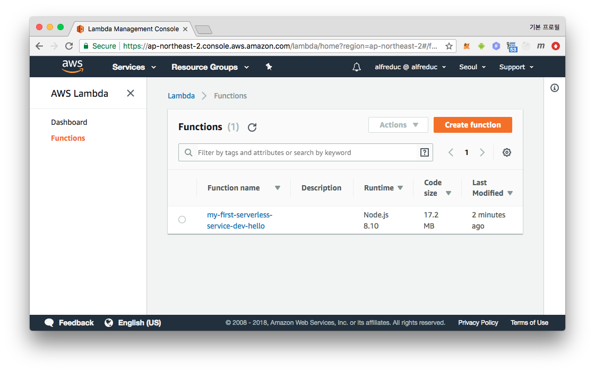

[Serverless Framework][serverless_framework] 는 AWS Lambda 와 API Gateway 와
같은 **serverless architecture** 들을 설정 코드를 통해 쉽게 배포하고 관리 할 수
있는 툴이다. 평소 API Gateway 와 Lambda 를 Web Console 을 통해 접해봤거나Hl
혹은 어떤 서비스인지 대충 알고만 있어도 serverless 를 시작하기에 무리가 없다.

serverless 라는 용어는 이 포스트에서 다룰 `serverless` 라는 툴을 의미하기도 하며
AWS Lambda 와 같은 EC2 인스턴스 없이 구동되는 서비스 또는 서비스 아키텍쳐를
의미하기도 한다.

# serverless 설치 (feat. npx)
serverless 는 nodejs 로 개발되었다. npm 이나 yarn 의 global 옵션으로 설치 할 수
있는데 요즘엔 global 옵션 설정보다 `npx` 를 사용하는 것이 더 좋아보인다. 새로운
프로젝트 디렉토리를 만들고 시작해보자.

```sh
$ mkdir my-serverless-project
$ cd $_
$ yarn init
$ yarn add serverless
$ npx serverless -v
```

`npx <command>` 는 nodejs 모듈 로드 메카니즘에 따라 `node_modules` 아래 `.bin`
디렉토리에 있는 실행가능한 파일을 찾아 실행해준다. `global` 설정을 사용해서
serverless 를 설치하면 서로 다른 serverless 버전을 사용하는 프로젝트를 동시에
진행하기 곤란하지만 `npx` 를 사용하여 `global` 에 serverless 를 사용하지 않고
프로젝트 디렉토리 밑 `node_modules` 를 사용하므로 이런 문제를 잘 해결해준다.

`node_modules` 에 해당 실행가능한 파일이 없다면 그때 npm registry 에서 받아온 후
실행시켜주는데, `docker run` 명령어로 이미지를 `pull` 받은 후 `run` 시켜주는
것과 비슷하다. 따라서 이 post 에서도 `npx` 를 사용하겠다.

# hello world
serverless 는 기본적으로 `serverless.yml` 이름의 설정 파일로부터 시작할 수 있다.

`serverless.yml`
```sh
service: my-first-serverless-service
frameworkVersion: ">=1.28.0"

provider:
  name: aws
  runtime: nodejs8.10
  stage: dev
  region: ap-northeast-2

functions:
  hello:
    handler: handler.hello
```

`us-east-1` 리전에 `hello` 란 이름의 Lambda function 을 만든다는 의미이다.
`handler` 를 주목하자. `handler.hello` 값은 `handler.js` 파일의 `hello` 란
이름의 export 된 함수를 실행하겠다는 의미이다. 아래와 같이 파일을 작성하자.

```js
// handler.js
module.exports.hello = (event, context, callback) => {
  callback(null, { statusCode: 200, body: 'Hello serverless!!' })
}
```

AWS Lambda 는 handler 함수를 트리거 할 때, callback 이라는 함수를 3번째 인자로
넣어준다. 앞에 event, context 객체는 나중에 다루기로 하고 callback 에 대해서만
간단하게 알자보자.  Lambda 함수 실행이 종료되었다는 것을 알리고 동시에 callback
을 통해 함수의 결과값을 반환할 수 있다. 첫번째 인자는 error 가 `Error` 객체를
하는 용도이고, 에러가 없다면 `null` 과 함께 정상 반환 값을 2번째 인자로 넣어주면
된다.  return 값이 아닌 callback 의 인자로 결과값을 반환받기 때문에 javascript
에서 주로 사용하는 비동기 프로세스를 쉽게 처리 할 수 있다.

## first deploy
자 이제 `handler.js` 파일과 `serverless.yml` 파일이 준비되었으니 Lambda function
을 생성해보자. 생성전 먼저 serverless 가 AWS API 를 사용할 수 있는 권한이 있어야
하는데, 권한있는 IAM 계정의 `ACCESS_KEY` 를 .envrc 파일에 아래와 같이 설정하자.

```sh
# .envrc
export AWS_ACCESS_KEY_ID=XXXXXXXXXXXXXXXXXXXXXXX
export AWS_SECRET_ACCESS_KEY=xxxxxxxxxxxxxxxxxxxxxxxxxxxxxxxxxxx
```

추가로 `.envrc` 파일이 형상관리되지 않도록 간단하게 `.gitignore` 에 추가하자.
다른 경로인 `.serverless/` 경로는 serverless 배포 등의 동작시 자동으로 생성되는
디렉토리이므로 역시 형상관리에서 제외하자.

```sh
# .gitignore
.serverless/
.envrc

node_modules/
yarn.lock
```

자 이제 `source` 명령어를 통해 `.envrc` 파일의 내용을 환경변수로 셋팅해준
`deploy` 명령어를 통해 첫 배포를 해볼 것 이다. `serverless` 를 줄여 `sls` 로
사용할 수 있는데, ~~타이핑치기 힘들어서~~앞으로는 `sls` 로 사용하겠다.


```sh
$ source .envrc
$ npx sls deploy --verbose
Serverless: Packaging service...
Serverless: Excluding development dependencies...
Serverless: Creating Stack...
Serverless: Checking Stack create progress...
.....
Serverless: Stack create finished...
Serverless: Uploading CloudFormation file to S3...
Serverless: Uploading artifacts...
Serverless: Uploading service .zip file to S3 (17.19 MB)...
Serverless: Validating template...
Serverless: Updating Stack...
Serverless: Checking Stack update progress...
...............
Serverless: Stack update finished...
Service Information
service: my-first-serverless-service
stage: dev
region: ap-northeast-2
stack: my-first-serverless-service-dev
api keys:
  None
endpoints:
  None
functions:
  hello: my-first-serverless-service-dev-hello
```

deploy 명령어는 다음과 같이 동작한다.
1. `serverless.yml` 설정 파일로 부터 AWS CloudFormation 템플릿 파일을 생성한다.
2. 아직 CloudFormation Stack 이 생성되지 않았을 경우 코드의 압축파일이 저장될 s3
   bucket 과 함께 Stack 을 생한다.
3. Lambda Function 코드들을 zip 파일로 압축한다.
4. 이전 배포된 모든 파일에 대한 hash 를 가져온 뒤 현재 로컬에 있는 파일들의 hash
   와 비교한다.
5. 만약에 hash 결과가 같으면 배포 프로세스는 종료된다.
6. hash 결과가 같지 않으면, zip 파일을 s3 bucket 에 업로드한다.
7. 모든 IAM Roles, Lambda Functions, Events 그 외 자원들이 AWS CloudFormation
   템플릿에 추가된다.
8. 새로운 CloudFormation 템플릿으로 Stack 을 업데이트 한다.
9. 각각의 배포는 각 Lambda Function 을 새로운 버전으로 발행한다.

잘 배포 되었는지 AWS Web Console 을 통해 확인해보자.




## invoke
`serverless invoke`
명령을 통해 배포한 Lambda function 을 실행해 볼 수 있는데, 아래 명령어로
배포한 hello handler 가 잘 동작하는지 트리거 시켜보고 callback 함수의 2번째
인자로 넘겨준 내용이 output 으로 잘 찍히는 것을 확인하자.

```
$ npx sls invoke -f hello
{
    "statusCode": 200,
    "body": "Hello serverless!!"
}
```

## package 설정
로그를 보면 17MB 정도의 파일을 올리는 것을 볼 수 있다. serverless 는 handler.js
코드 안에서 어떤 라이브러리를 사용하고 어떤 코드와 종속성을 가지는지 알 수 없기
때문에 기본설정으로 `node_modules/` 디렉토리 포함 현재 디렉토리의 모든 파일을
압축해서 올리고 있는 것인데, 이는 현재 `hello` Lambda function 을 수행하는데
불필요하다.  `serverless.yml` 파일에 `package` 설정을 추가하여 불필요한 파일들이
package 되어 업로드 되는 문제를 해결해보자.

```diff
 service: my-first-serverless-service
 frameworkVersion: ">=1.28.0"

+package:
+  exclude:
+    - ./**
+  include:
+    - handler.js
+
```

모든 파일을 제외한 뒤 handler.js 파일만 업로드 하는 설정이다. 다시 한번
배포해보자.

```sh
$ npx sls deploy
...skip...
Serverless: Uploading artifacts...
Serverless: Uploading service .zip file to S3 (253 B)...
Serverless: Validating template...
...skip...
```

이제 253B, 딱 필요한 파일만 upload 되는 것을 볼 수 있다. `package` 설정을 통해
업로드 되는 코드의 용량이 줄어들 뿐만 아니라 무심코 API KEY 같은 파일이 s3 로
업로드 되는 실수 등도 방지 할 수 있다.  내부적으로 serverless 는 Lambda function
이 실행할 코드와 Lambda function 배포를 위한 cloudformation 설정 파일을 s3
버킷을 임의로 생성하여 사용하는데 아래 명령어를 통해 어떤 deploy 버킷의 이름을
확인 할 수 있다.

```sh
$ npx sls info --verbose
Service Information
service: my-first-serverless-service
stage: dev
region: ap-northeast-2
stack: my-first-serverless-service-dev
api keys:
  None
endpoints:
  None
functions:
  hello: my-first-serverless-service-dev-hello

Stack Outputs
HelloLambdaFunctionQualifiedArn: arn:aws:lambda:ap-northeast-2:539425821792:function:my-first-serverless-service-dev-hello:5
ServerlessDeploymentBucketName: my-first-serverless-serv-serverlessdeploymentbuck-k11zvp877tpm
```

`ServerlessDeploymentBucketName` 의 값이 바로 배포를 위해 사용하는 버킷이름인데,
따로 설정해주시 않으면 임의로 설정되며, 나중에 배포가 잘 안되어 디버깅 할 때 이
버킷을 방문하게 될 것이다. 심심하면 지금 S3 해당 버킷에 방문하여 앞서 배포한
2건의 차이를 확인해보아도 좋다.

## logging
디버깅을 위해서라도 로깅은 반드시 필요하다.  `handler.js` 파일에
`console.log` 코드를 삽입 한 뒤 확인해보자.

```diff
// handler.js
module.exports.hello = (event, context, callback) => {
+ console.log("hello!!!")
  callback(null, { statusCode: 200, body: 'Hello serverless!!' })
}
```

```sh
$ npx sls deploy
$ npx sls invoke -f hello --log
```

`--log` 옵션을 붙여야만 로그가 나온다. 뿐만 아니라 **serverless** 가 기본으로
LogGroup 을 설정해줘서 AWS CloudWatch 의 Logs 메뉴에서
`/aws/lambda/my-first-serverless-service-dev-hello` 와 같은 로그 그룹을 찾을 수
있고 클릭해서 들어가면 Lambda function 의 트리거와 종료, 그리고 "hello!!!" 로그
등을 확인 할 수 있을 것이다.

# AWS 자원 사용하기 - S3
Labmda 로 s3 특정 버킷에 접근하기 위해 `serverless.yml` 파일 `provider` 설정
아래 `iamRoleStatements` 설정을 아래와 같이 추가해보자.

```diff
 provider:
   name: aws
   runtime: nodejs8.10
-  stage: dev
+  stage: ${env:SLS_STAGE}
   region: ap-northeast-2
+  iamRoleStatements:
+    - Effect: Allow
+      Action:
+        - s3:*
+      Resource: "arn:aws:s3:::${env:SLS_BUCKET_NAME}/*"
```

## serverless.yml 설정에 환경변수 사용하기
s3 버킷 이름등을 하드코딩하면 다른 환경에서 사용하거나 오픈소스로 오픈할 때
사용하는 사람은 코드를 수정해야만 할 것이다. 환경 마다 달라질 수 있는 부분은
환경변수로 따로 빼는 것이 좋다. 이런 환경변수를 `.envrc` 파일에 추가하자.

```sh
# .envrc
export AWS_ACCESS_KEY_ID=XXXXXXXXXXXXXXXXXXXXXXX
export AWS_SECRET_ACCESS_KEY=xxxxxxxxxxxxxxxxxxxxxxxxxxxxxxxxxxx
+export SLS_STAGE=dev
+export SLS_BUCKET_NAME=my-bucket-for-sls-1123
```

다른 프로그램들과 환경변수 충돌을 방지하기 위해 `SLS_` 를 프리픽스로 사용했다.
`stage` 부분도 환경변수로 함께 뺐다.

## s3 bucket access
nodejs 라이브러리인 [aws-sdk][aws_sdk_js] 를 사용하여 s3 버킷의 파일 목록을
가져와보자.

```
$ aws s3api create-bucket --bucket $SLS_BUCKET_NAME
$ aws s3 cp image1.jpg s3://$SLS_BUCKET_NAME/
$ aws s3 cp image2.jpg s3://$SLS_BUCKET_NAME/
```

## Labmda Function 에 환경변수 사용하기
`handler.js` 에 `s3ObjectList` 라는 named export 함수를 아래와 같이 하나 더
만들자.

```diff
+module.exports.s3ObjectList = (event, context, callback) => {
+  const s3 = new AWS.S3({apiVersion: '2006-03-01'});
+  const params = { Bucket: process.env.SLS_BUCKET_NAME, MaxKeys: 10 };
+  s3.listObjects(params, (err,data) => {
+    if( err ) {
+      callback(err)
+      return
+    }
+    callback(null, { statusCode: 200, body: data })
+  })
+}
```

`process.env.SLS_BUCKET_NAME` 을 주목하자. 이 코드는 로컬이 아닌 AWS Lambda
Function 으로 실행되는 코드이다. 아무리 `source .envrc` 로 로컬에 환경 변수
셋팅을 해놓았을지라도 Lambda Function 실행환경에서의 환경변수가 셋팅되지는
않는다. `environment` 설정을 통해서 Lambda Function 실행환경의 환경 변수를
셋팅 할 수 있다.

```diff
 provider:
   name: aws
   runtime: nodejs8.10
   stage: ${env:SLS_STAGE}
   region: ap-northeast-2
+  environment:
+    SLS_BUCKET_NAME: ${env:SLS_BUCKET_NAME}
   iamRoleStatements:
     - Effect: Allow
```

위처럼 `provider` 설정 아래에 `environment` 설정을 두고 `KEY: Value` 로
설정 하면 모든 `functions` 아래 handler 들이 영향 받는다.

```diff
 functions:
   hello:
     handler: handler.hello
+    environment:
+      ENV_FOR_HELLO: env_for_hello
+      SLS_BUCKET_NAME: check-environment
   s3ObjectList:
     handler: handler.s3ObjectList
```

연습을 위해 `hello` handler 아래에도 environment 를 추가했다. 여기의
`SLS_BUCKET_NAME` 은 위 `provider` 쪽에 설정한 같은 이름의 환경변수를 덮어쓰기
할 것 이다. `hello` 쪽에 추가한 환경 변수는 공부삼아 한번 확인해 보길 바라고
이제 s3 object list 를 잘 가져오는지 확인해보자.

```sh
$ npx sls deploy -v
$ npx sls invoke -f s3ObjectList
$ npx sls invoke -f s3ObjectList | jq -r .body | jq .Contents[].Key
```

자알 가져온다.

# 모듈화 & 서드파티 모듈 사용하기
npm 을 통해 설치한 서드파티 모듈을 사용하는 Lambda Function 을 작성해보자.  흔한
예제인 이미지 리사이징을 해볼텐데, s3 의 이미지를 가져오고, 리사이징하고, 다시
업로드 시키는 함수는 다음과 같다.

```js
// src/imgUtil.js
import AWS from 'aws-sdk'
import path from 'path'
import fs from 'fs'
import { ulid } from 'ulid'
import _gm from 'gm'

const gm = _gm.subClass({ imageMagick: true })
const s3 = new AWS.S3()

export const downloadImage = (bucketName, key) => new Promise((resolve, reject) => {
  const destPath = path.join('/tmp', (new Date()).getTime().toString())
  s3.getObject({ Bucket: bucketName, Key: key }).promise().then( data => {
    fs.writeFile(destPath, data.Body, err => err ? reject(err) : resolve(destPath))
  }).catch( reject )
})

export const getImageInfo = imagePath => new Promise((resolve, reject) => {
  gm(imagePath).identify((err, info) => err ? reject(err) : resolve(info))
})

export const resizeImage = (info, size) => new Promise((resolve, reject) => {
  const resizeOpts = /^(\d+)x(\d+)([%@!<>])?$/g.exec( size )
  gm(info.path).resize(resizeOpts[1], resizeOpts[2], resizeOpts[3])
 .toBuffer(info.format, (err, buffer) => err ? reject(err) : resolve(buffer))
})

export const uploadImage = (buffer, info, bucketName, prefix) =>
  s3.upload({
    Bucket: bucketName,
    Key: `${prefix}/${ulid()}.${info.format}`,
    Body: buffer,
    ContentType: info['Mime type'],
  }).promise()
```

handler.js 쪽에서 이 코드를 불러와 사용해보자. 테스트로 objectList 로 가져온
0번째 이미지를 리사이즈 해볼 것 이다. js 파일들이 1개 이상 되었으므로 설정
파일과 실제 동작하는 코드를 분리하기 위해 코드들을 `src/` 디렉토리 밑으로 넣는
리팩토링도 함께 진행하자.

```diff
const AWS = require('aws-sdk')
+const imgUtil = require('./imgUtil')

+module.exports.resize = (event, context, callback) => {
+  let imgInfo
+  s3.listObjects({ Bucket: BUCKET_NAME }).promise().then( objectList => {
+    console.log( JSON.stringify(objectList,null,2) )
+    return downloadImage( BUCKET_NAME, objectList.Contents[0].Key )
+
+  }).then( imgPath => {
+    console.log( `imgPath: ${imgPath}` )
+    return getImageInfo( imgPath )
+
+  }).then( _imgInfo => {
+    imgInfo = _imgInfo
+    console.log( 'imgInfo: ' )
+    console.log( JSON.stringify(imgInfo,null,2) )
+    return resizeImage(imgInfo, '800x600')
+
+  }).then( buffer => {
+    return uploadImage(buffer, imgInfo, BUCKET_NAME, 'resize')
+
+  }).then( data => {
+    callback(null, { statusCode: 200, body: JSON.stringify(data,null,2) })
+
+  }).catch( err => {
+    callback(err)
+  })
+}
```


## serverless-webpack
위에서 `package` 설정을 했기 때문에 배포하게되면 여전히 handler.js 파일 하나만
올라가게 되는 것을 볼 수 있다. 어떻게 해야 할까?

package 설정에 include 로 `imgUtil.js` 파일을 추가해주고, 이 파일에서 사용하는
`gm` 이라는 모듈이 올라가도록 `node_modules/gm` 을 추가해주면 될까?  답부터
말하자면 좋지 않은 방법이다. 파일이나 모듈을 하나 추가할 때마다 `serverless.yml`
파일 package.include 에 설정을 하나씩 추가해야 하는 것은 굉장히 귀찮을 뿐만
아니라 `gm` 모듈이 사용하는 sub dependencies 들이 모두 `node_modules/gm` 아래에
설치된다는 보장도 없다. 다른 방법을 찾아야 하는데 그 해답은 `webpack` 이다.

webpack 은 브라우저에서 모던 javascript 코드를 돌리기 위한 bundling, minify 등의
전처리를 해주는 툴인데, `nodejs` 환경에서도 사용 할 수 있으며, `gm` 모듈과 같은
서드파티 모듈들을 실행가능한 단일 bundle 파일로 만들어주는 기능을 사용 할
것이다. `serverless-webpack` plugin 을 사용하면 serverless 배포시 자동으로
실행해주고 오프라인 개발환경까지 지원해준다.

```
$ yarn add webpack serverless-webpack
$ yarn add babel-loader babel-core babel-preset-env
```

webpack 은 다음과 같은 `webpack.config.js` 설정 파일을 사용한다.

```js
const path = require('path')
const slsw = require('serverless-webpack')
const _ = require('lodash')

module.exports = {
  mode: slsw.lib.webpack.isLocal ? "development" : "production",
  entry: _.isEmpty(slsw.lib.entries) ? './handler.js' : slsw.lib.entries,
  output: {
    libraryTarget: 'commonjs',
    path: path.resolve(__dirname, '.webpack'),
    filename: 'handler.js',
  },
  module: {
    rules: [{
      test: /\.js$/,
      exclude: /node_modules/,
      loader: 'babel-loader',
      options: {
        presets: ['env'],
      }
    }],
  },
  target: 'node',
  externals: ['aws-sdk'],
}
```

test 해보자.
```
$ npx webpack
Hash: b7e7a2496ea7f73e2ccc
Version: webpack 4.16.1
Time: 2378ms
Built at: 2018-07-22 16:06:20
     Asset    Size  Chunks             Chunk Names
handler.js  61 KiB       0  [emitted]  main
Entrypoint main = handler.js
 [0] external "fs" 42 bytes {0} [built]
 [2] external "path" 42 bytes {0} [built]
 [3] external "child_process" 42 bytes {0} [built]
 [4] external "util" 42 bytes {0} [built]
 [5] external "os" 42 bytes {0} [built]
 [6] external "aws-sdk" 42 bytes {0} [built]
 [7] external "stream" 42 bytes {0} [built]
[13] ./src/handler.js 2.12 KiB {0} [built]
[14] ./src/imgUtil.js 2 KiB {0} [built]
[16] external "crypto" 42 bytes {0} [optional] [built]
[18] external "events" 42 bytes {0} [built]
[50] external "tty" 42 bytes {0} [built]
    + 45 hidden modules
```

좀 더 자세한 로그를 보고싶다면 `--display-modules` 옵션을 붙여서 다시한번
실행해보자.  `fs` 같은 nodejs native library 들은 `external` 디펜던시로 처리되어
함께 번들링 되지 않는다. 또한 `aws-sdk` 도 Lambda 실행환경에서 제공되기 때문에
올릴 필요가 없어서 webpack 설정의 `externals` 설정으로 번들링을 제외시키는 것이
좋다.

`serverless.yml` 에 `serverless-webpack` 설정을 해야한다.

```yaml
plugins:
  - serverless-webpack

custom:
  webpack:
    includeModules: false
    webpackConfig: webpack.config.js
    packager: yarn
```

이제 serverless deploy 하게 되면 자동으로 webpack 이 실행되며 번들링된 파일이
패키징되어 upload 된다.

```
$ npx sls deploy -v
```

에러 없이 배포와 실행이 잘 되었다면 AWS Web Console 을 통해 `resize` prefix 아래
resize 된 파일이 생성되었는지 확인하자.

# event 설정
지금까지는 serverless 의 invoke 명령을 통해서 즉, 내부적으로 AWS API 를 통해
Lambda Function 을 트리거 시켰다. events 설정을 통해 Lambda Function 을 여러가지
방법으로 트리거 시킬 수 있다. 가장 많이 사용되는 2가지 방법에 대해 알아보자.

## API Gateway
API Gateway 를 통해 http 요청으로 Lambda Funtion 을 트리거 시킬 수 있게 각각의
Function 에 `events` 설정을 추가해보자.

```diff
 functions:
   hello:
     handler: handler.hello
+    events:
+      - http:
+          path: hello
+          method: get
   s3ObjectList:
     handler: handler.s3ObjectList
+    events:
+      - http:
+          path: s3ObjectList
+          method: get
```

이것은 handler.hello Function 을 `/hello` path 로, handler.s3ObjectList 를
`/getObjectLilst` path 를 통해 트리거 시킬 수 있도록 API Gateway 를 설정하라는
의미이다.  해본 사람은 알겠지만 AWS Web Console 로 이정도 설정 하는 것도 꽤
귀찮고 어려운 작업이다.  `serverless` 의 첫번째 장점이 바로 이런 복잡한 인프라
자원의 설정을 yml 파일을 통해 알아서 자동으로 해주는 `Infrastructure as code` 를
구현할 수 있게 해주는 점이다. 배포해보자.

```
$ npx sls deploy --verbose
Serverless: Packaging service...
Serverless: Excluding development dependencies...
Serverless: Uploading CloudFormation file to S3...
Serverless: Uploading artifacts...
Serverless: Uploading service .zip file to S3 (651 B)...
Serverless: Validating template...
Serverless: Updating Stack...
Serverless: Checking Stack update progress...
......................
Serverless: Stack update finished...
Service Information
service: my-first-serverless-service
stage: dev
region: ap-northeast-2
stack: my-first-serverless-service-dev
api keys:
  None
endpoints:
  GET - https://l4gj9125q9.execute-api.ap-northeast-2.amazonaws.com/dev/hello
  GET - https://l4gj9125q9.execute-api.ap-northeast-2.amazonaws.com/dev/s3ObjectList
functions:
  hello: my-first-serverless-service-dev-hello
  getObjectList: my-first-serverless-service-dev-getObjectList
Serverless: Removing old service artifacts from S3...
```

output 의 `endpoints` 를 주목하자. `l4gj9125q9` 와 같이 고유의 API Gateway
주소가 생성되고 2개의 주소를 각각 브라우저로 접속해서 결과가 잘 나오는지
확인해보자.

## S3 ObjectCreated event
s3 에 파일을 업로드하면 발생하는 ObjectCreated 이벤트로 Lambda Function 을
호출해보자. 위에서 작성한 resize handler 는 s3 `upload` prefix 아래에 있는
첫번재 이미지를 resize 하게 작성되어 있다. 이것을 조금 변경하여 `upload` prefix
로 새로운 이미지가 올라왔을때 그 이미지를 resize 한뒤 `resize` prefix 에 업로드
시키는 코드로 변경해보자.

```diff
  resize:
    handler: handler.resize
    events:
    - s3:
      bucket: ${env:SLS_BUCKET_NAME}
        event: s3:ObjectCreated:*
        rules:
        - suffix: .png
```

### serverless-plugin-exist-s3


# react
마지막으로 지금까지 만든 기능들을 Web UI 로 만들어보자.  react 를 사용할 것인데
webpack 을 이미 적용했기 때문에 server side 렌더링을 위한 코드만 몇 줄 적으면
react 로 만든 웹 페이지도 어렵지 않게 추가 할 수 있다.

```
$ yarn add react react-dom babel-preset-react
```

```js
// App.js
```

html 페이지를 내려주는 Labmda Function 하나를 더 만들어 보자.

```yml

```

s3 에 있는 이미지 파일들은 s3 버킷이 public 설정이 되어있지 않는 한 접근 할 수 없다.
하지만 public 설정은 보안에 취약하고 

# SNS
마지막으로 serverless 설정 몇줄을 추가하여 Lambda Function 에 에러가 있을때
AWS SNS 를 통해 알림을 받도록 추가해보자.


[serverless]: https://serverless.com/
[serverless_framework]: https://serverless.com/framework/

https://serverless.com/framework/docs/providers/aws/guide/deploying#how-it-works
https://github.com/serverless/examples
[aws_sdk_js]: https://github.com/aws/aws-sdk-js

https://github.com/mgi166/serverless-image-resizer/blob/master/src/imageResizer.js

